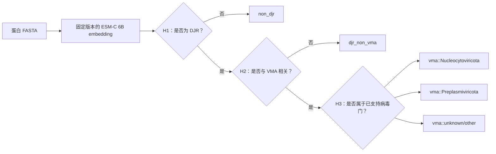

[English](README.md) | **简体中文**

# DJR-MCP Finder

[](https://github.com/Hongda-Zhao/DJR-MCP-Finder/actions/workflows/ci.yml)
[](https://www.python.org/)
[](https://github.com/Hongda-Zhao/DJR-MCP-Finder/releases)

**使用冻结的三阶段蛋白语言模型分类器，从蛋白 FASTA 中检测 double-jelly-roll major capsid
protein（DJR-MCP）。** DJR-MCP Finder 面向病毒学与生物信息学用户，用于对 DJR 蛋白、病毒形态发生
相关 DJR，以及两个已支持病毒门进行可审计的初筛。

> **推荐正式版本：** [`user-inference-v0/`](user-inference-v0/README.cn.md) 中冻结的
> **model V0**。输入蛋白 FASTA，输出表格化预测、运行 metadata 和 checksum；不会训练或重新调参。

## 从 FASTA 到可审计结果



`vma::unknown/other` 是样本通过 H1/H2 后的拒绝选项，不是通用未知病毒或 OOD 检测器。

## 快速开始：仅 CPU 检查

普通笔记本即可安装正式 V0 包、运行合同测试、校验 FASTA 和检查冻结模型；这些操作不会下载
ESM-C，也不需要 PyTorch：

```bash
git clone https://github.com/Hongda-Zhao/DJR-MCP-Finder.git
cd DJR-MCP-Finder/user-inference-v0

python3 -m venv .venv
source .venv/bin/activate
python -m pip install --upgrade pip
python -m pip install -e '.[dev]'

python -m pytest -q
djrmcp-predict validate-fasta examples/synthetic_example.faa
djrmcp-predict model-info
```

命令使用 Linux/macOS shell；native Windows 尚未验证。若不需要 editable install，可将
`-e '.[dev]'` 替换为 `'.[dev]'`。

## 完整 V0 prediction：NVIDIA 工作站

已验证的完整 inference 路径需要 Linux x86_64、Docker、NVIDIA Container Toolkit 和 CUDA GPU，
建议至少 24 GB 显存。在正式 V0 包目录中构建并运行：

```bash
cd /path/to/DJR-MCP-Finder/user-inference-v0
bash workstation/build.sh

bash workstation/run_user_fasta.sh \
  examples/synthetic_example.faa \
  run_output/sample \
  0
```

`0` 是物理 GPU index。第一次 prediction 会下载固定的 ESM-C 6B checkpoint；之后复用 cache，并可
设置 `DJRMCP_OFFLINE=1`。V0 实测 peak allocated GPU memory 约 13.05 GB；CPU 模式则会加载约
25 GB float32 权重，不属于常规部署路径。

## 输出示例

每次运行生成 `predictions.tsv`、`run_metadata.json` 和 `CHECKSUMS.sha256`。下面是缩短后的示意视图；
真实 TSV 还会记录序列 metadata、raw score、全部概率、warning 和 gate 状态。

| protein_id | H1 DJR probability | H2 VMA probability | H3 prediction | final_prediction |
| --- | ---: | ---: | --- | --- |
| candidate_001 | 0.997 | 0.981 | Nucleocytoviricota | `vma::Nucleocytoviricota` |
| cellular_djr_002 | 0.994 | 0.082 | not_reached | `djr_non_vma` |
| background_003 | 0.006 | 0.021 | not_reached | `non_djr` |

以上数值只用于说明输出 schema，并非 benchmark 结果。完整输入/输出合同见
[`user-inference-v0` 指南](user-inference-v0/README.cn.md)；cache、offline、device 和 host path 见
[`Docker 部署指南`](user-inference-v0/workstation/README.cn.md)。

## 选择正确入口

| 目标 | 从这里开始 | 环境 |
| --- | --- | --- |
| 校验 FASTA 或检查冻结模型 | [`user-inference-v0/`](user-inference-v0/README.cn.md) | Python 3.10+、CPU |
| 运行正式 model V0 prediction | [V0 工作站指南](user-inference-v0/workstation/README.cn.md) | Linux x86_64、Docker、NVIDIA GPU |
| 评估尚未发布的 mixed-encoder candidate | [`user-inference-v0.1/`](user-inference-v0.1/README.cn.md) | Python 3.12+、两个隔离模型 runtime |
| 审计或复现研究工作流 | [`WORKFLOW_V0.md`](WORKFLOW_V0.md) | 本地 archive、database、软件栈与 HPC 资源 |

V0.1 是冻结后的开发证据，不替代正式 model V0。仅靠 compact checkout 无法完整复现研究工作流。

## 文档导航

- [正式 V0 用户指南](user-inference-v0/README.cn.md)
- [Docker/NVIDIA 部署](user-inference-v0/workstation/README.cn.md)
- [冻结 V0 model card](user-inference-v0/src/djrmcp_predict/assets/project-v0-esmc6b-r1/MODEL_CARD.md)
- [完整工作流与证据边界](WORKFLOW_V0.md)
- [精简科研报告](PROJECT_V0_FINAL_REPORT.md)
- [V0.1 开发候选](user-inference-v0.1/README.cn.md)
- [引用信息](CITATION.cff)

## 科学状态与限制

正式版本仍是 **all ESM-C 6B**。schema 5、PLM-vs-classical 和 ultra-remote 分析都是冻结后的
Train/Validation 证据，均未打开 protected Test，也没有改变 model V0。当前 score 是开发数据分布下的
calibrated score，不是自然蛋白组中的 prevalence-adjusted probability。大规模发现仍需独立的
false-positive 评估，以及结构和人工验证。

## 冻结的 V0

- 数据：560 VMA-DJR、500 cellular DJR、5,000 HardNeg、5,000 background。
- split：Train/Validation/Test = **6,634 / 2,212 / 2,214**；exact/source/component/MMseqs2 关系先
  合并再切分，residual qualifying cross-split edge = **0**。
- 模型选择：14 个表示模型共享 Train-only 5-fold component map；综合分
  `S = 0.60·H1 AP + 0.30·H2 AP + 0.10·H3 macro-F1`，再经 Validation 三 Head gate 和 paired
  one-SE，选择 ESM-C 6B（`S=0.997145`）。

| Head | 任务 | classifier | temperature | threshold |
| --- | --- | ---: | ---: | ---: |
| H1 | DJR / non-DJR | alpha=`1e-5` | 1168.1537298613255 | 0.9687754839244975 |
| H2 | VMA-DJR / cellular DJR | C=`0.01` | 0.8241381150130028 | 0.9639353725025007 |
| H3 | two known phyla + reject | C=`10` | 4.2474179687096845 | 0.7126488980564439 |

H2 仅在 H1 判为 DJR 后运行；H3 仅在 H2 判为 VMA-DJR 后运行。H3 的 `unknown/other` 是拒绝硬分到
Nucleocytoviricota 或 Preplasmiviricota，不是通用未知病毒检测。

## 最新证据分层

| evidence | status | 可以回答 | 不能回答 |
| --- | --- | --- | --- |
| 14-model benchmark | frozen development selection | 哪个 all-one-encoder system 被选为 V0 | 外部泛化 |
| schema 5 Amendment D | 20/20 gates PASS | 同一四来源 family members 上的 8-model/9-cascade 稳健性 | 独立 Test、回调选模 |
| PLM vs classical V0 | internal cross-fit PASS | Train components 上 PLM retrieval 与经典检索的差异 | 外部 superiority |
| ultra-remote V0/V0.1 | PASS；formal claim blocked | V0.1 在内部 holdout/低覆盖压力层的表现 | 正式 `<20% identity` 结论 |
| prospective/external Test | **not run** | — | V0/V0.1 的发布级泛化结论 |

### schema 5：值得外部确认的 mixed candidate

预注册的 9 个 mixed candidates 只按既有 Train-CV 排序；四来源 robustness 不参与重排。当前 nominee 是
**H1/H2 ESM-2 3B + H3 ESM-C 6B**（`S=0.997645`），相对 all-6B 为 `0/4` Holm-corrected
source warnings；这不等同于四来源 non-inferiority 或 equivalence 证明：

| system | viral | cellular | background | matched HardNeg | always-on / worst-case s·seq⁻¹ |
| --- | ---: | ---: | ---: | ---: | ---: |
| frozen all ESM-C 6B | 0.9536 | 0.8791 | 0.9948 | 0.9978 | 0.059531 / 0.059531 |
| mixed nominee | 0.9537 | 1.0000 | 0.9985 | 0.9998 | 0.023524 / 0.083055 |

nominee 的 viral strict clusters 为 52/69，低于 all-6B 的 55/69；走到 H3 时还需第二个 encoder。
正式状态只是 `recommended_for_external_confirmation`，`released_v0_change_permitted=0`。

### PLM vs classical：内部结果不支持 ESM-C cosine 更灵敏

在 6,634 条 Train records 上采用 cyclic 3-fit/1-calibration/1-evaluation component cross-fit。以下为
fold-macro component AP / sensitivity at a threshold calibrated to a 99.5% specificity target：

| method | H1 | H2 |
| --- | ---: | ---: |
| ESM-C 6B cosine | 0.8719 / 0.7340 | 0.9861 / 0.9306 |
| BLASTP | 0.9392 / 0.8692 | 0.9829 / 0.9443 |
| DIAMOND ultra | 0.9406 / 0.9025 | 0.9806 / 0.9317 |
| MMseqs2 | 0.9319 / 0.8805 | 0.9751 / 0.9119 |
| component-HMMER | 0.9542 / 0.9016 | 0.9911 / 0.9569 |
| ESM-2 650M cosine, contextual | 0.9515 / 0.8954 | 0.9965 / 0.9977 |

ESM-C cosine 的 H1 paired delta CI 对四个 classical anchors 均为负；H2 与 end-to-end 的 CI 跨 0，且
受 singleton component 的低-FPR 分辨率限制。这是 representation retrieval 比较，不等于冻结 supervised
V0 工具的外部性能。Validator 独立重算点估计，但未独立重跑全部 10,000 bootstrap。

### ultra-remote：V0.1 有信号，但正式结论被阻断

V0.1 只把 H1/H2 encoder 改为 ESM-2 3B，H3 仍为 ESM-C 6B。Train-only component holdout 中 H1
encoder sensitivity 相对 V0 为 `+0.197`；BLAST-defined `qcov<80%` 压力层为 `+0.260`
（95% CI 0.206–0.317）。但 H1 supervised detector 只提高 `+0.017`，H2/end-to-end detector 为 0；
所有 paired systems 至少一个 fold 未守住实际 99.5% specificity。严格 `qcov≥80%, identity<20%` 只有
1 个独立 positive component，因此状态是 `PASS_WITH_FORMAL_ULTRA_REMOTE_BLOCKED_BY_SAMPLE_SIZE`。

## 当前发布边界

历史 Test 数字只属于 ESM-2 650M。all ESM-C 6B、schema 5 nominee 和 V0.1 均为 `not_evaluated`。
因此当前可以发布 component-safe 数据构筑、开发 benchmark、冻结 V0 工具和明确标注的内部 stress tests；
不能声称 V0.1 已替代 V0、PLM 已在外部数据胜过经典方法、或工具能普适识别未知病毒。

## 权威入口

- `WORKFLOW_V0.md`：唯一完整工作流与证据边界。
- `PROJECT_V0_FINAL_REPORT.md`：当前精简科学报告。
- `results/validation_family_robustness_v0_schema5_mixed_heads/`：schema 5 正式 compact results。
- `results/figures/project_v0/validation_family_robustness_v0_schema5_head_focus/`：只读出版图 companion。
- `benchmarks/plm_vs_classical_v0/`：内部 PLM/classical compact benchmark。
- `benchmarks/ultra_remote_v0_v01/`：V0/V0.1 compact development audit。
- [`user-inference-v0/`](user-inference-v0/README.cn.md)：冻结 all ESM-C 6B 的正式用户 FASTA 推理包。
- [`user-inference-v0.1/`](user-inference-v0.1/README.cn.md)：mixed-encoder V0.1 候选推理包；不替换 V0。

## 在其他路径运行研究工作流

GitHub 检出目录可以位于任意位置。未被独立 scientific checksum 冻结的活动 shell/PBS 入口优先读取
`DJRMCP_PROJECT_ROOT`，否则根据脚本位置（PBS 下也可使用 `PBS_O_WORKDIR`）定位仓库；本地 Python
环境可用 `DJRMCP_VENV_ROOT` 指定。示例变量见 [`.env.example`](.env.example)。

仓库中的 `configs/`、benchmark `config/`、`FULL_ARTIFACT_POINTER.json`、验证记录和报告仍保留当时
gds2 的绝对路径。这些字符串是冻结 provenance 或 archive locator，不能直接批量替换。需要复跑时，先为
本机生成一个不纳入科学 checksum 的运行副本：

```bash
export DJRMCP_PROJECT_ROOT="$(pwd -P)"
export DJRMCP_ARCHIVE_ROOT=/absolute/path/to/checksum-bound-archives
export DJRMCP_DATABASE_ROOT=/absolute/path/to/frozen-input-databases
export DJRMCP_SOFTWARE_ROOT=/absolute/path/to/versioned-HPC-software
export DJRMCP_VENV_ROOT=/absolute/path/to/project-python-environment

python scripts/render_portable_config.py \
  configs/v0_dataset.json \
  build/local-configs/v0_dataset.json

DJRMCP_DATASET_CONFIG="$PWD/build/local-configs/v0_dataset.json" \
  bash scripts/build_v0_dataset.sh
```

同一工具也可处理 YAML 和两个 compact benchmark 的 JSON 配置；`--map OLD=NEW` 可增加更细的
前缀映射。它默认 fail closed：只要生成配置仍含未映射的历史 operational root 就不写出文件，并且
永不覆盖输入配置。复跑仍应按各自 README 恢复完整 archive，生成的站点配置放在 checksum scope
之外，不原地改写冻结 config。schema-5 Amendment D 的
`legacy_schema4_numerical_operator.venv_root` 是 exact
numeric replay 合同的一部分，会被刻意保留；完整 Amendment-D 重放仍须挂载原始已验证环境，不能把这个
provenance 字段伪装成本机路径。production Test ledger 同样固定在原管理员 registry，公开检出没有覆盖入口。

本 GitHub 可移植打包参数化了文档和运行入口，并补强模型反序列化前的 checksum 校验；因此相应刷新
顶层、schema-5 source 与两个 compact benchmark 的 source-bundle checksum manifests。模型 heads、
release 参数、冻结 config、数值结果和它们的内部 artifact checksums 均未改变；原始 gds2 版本仍由
日期化 archive 及其 provenance 记录保存。

完整运行产物、日志、数据库、TIFF、旧图和开发候选代码的历史位置仍记录为
`/aptmp/hongda/DJRMCP_Develope/` 下的日期化 checksum-bound archives；这是来源记录，不是 GitHub
检出的运行要求。活动工程只保留解释与复核所需的 compact core。
