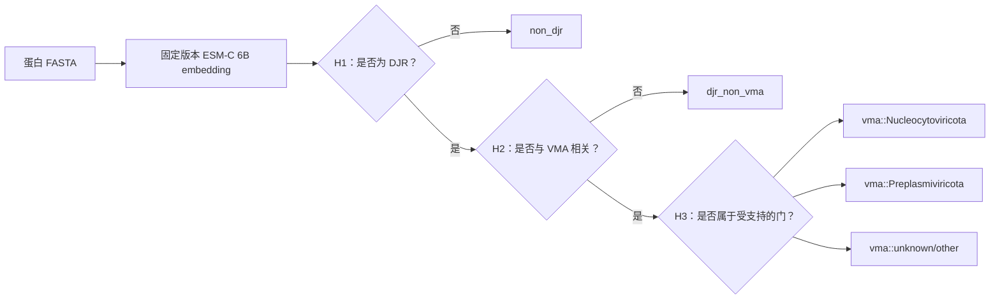

[English](README.md) | **简体中文**

# DJR-MCP Finder

[](https://github.com/Hongda-Zhao/DJR-MCP-Finder/actions/workflows/ci.yml)
[](https://www.python.org/)
[](https://github.com/Hongda-Zhao/DJR-MCP-Finder/releases)
[](LICENSE)

**使用冻结的三级蛋白语言模型分类器，从蛋白 FASTA 中检测 double-jelly-roll major capsid
protein。** DJR-MCP Finder 面向病毒学与生物信息学使用者，提供可审计的 DJR、病毒形态发生相关
DJR 及两个受支持病毒门的第一轮筛查。

> **推荐模型：** [`model-v0`](user-inference-v0/README.cn.md)——已发布的全 ESM-C-6B bundle。
> 输入蛋白 FASTA，输出 prediction、运行 metadata 与 checksum；不会训练或重新调参。

## 从 FASTA 到可审计结果



`vma::unknown/other` 只是通过 H1/H2 后的 reject option，不是普适未知病毒或 OOD detector。

## 快速开始：仅 CPU 检查

以下命令安装正式 V0 推理包、运行合同测试、校验 FASTA 并检查冻结 bundle；不会下载 ESM-C 或
PyTorch：

```bash
git clone https://github.com/Hongda-Zhao/DJR-MCP-Finder.git
cd DJR-MCP-Finder/user-inference-v0

python3 -m venv .venv
source .venv/bin/activate
python -m pip install -e '.[dev]'

python -m pytest -q
djrmcp-predict validate-fasta examples/synthetic_example.faa
djrmcp-predict model-info
```

尚未验证原生 Windows。完整推理使用 [Docker/NVIDIA 工作站路径](user-inference-v0/workstation/README.cn.md)，
建议至少 24 GB CUDA GPU 显存：

```bash
cd /path/to/DJR-MCP-Finder/user-inference-v0
bash workstation/build.sh
bash workstation/run_user_fasta.sh examples/synthetic_example.faa run_output/sample 0
```

## 输出示例

每次运行生成 `predictions.tsv`、`run_metadata.json` 和 `CHECKSUMS.sha256`。下表仅展示 schema，
不是 benchmark 结果。

| protein_id | H1 DJR 概率 | H2 VMA 概率 | H3 prediction | final_prediction |
| --- | ---: | ---: | --- | --- |
| candidate_001 | 0.997 | 0.981 | Nucleocytoviricota | `vma::Nucleocytoviricota` |
| cellular_djr_002 | 0.994 | 0.082 | not_reached | `djr_non_vma` |
| background_003 | 0.006 | 0.021 | not_reached | `non_djr` |

完整输入输出合同见[正式 V0 用户指南](user-inference-v0/README.cn.md)。

## Release、模型与包版本

以下标识描述不同层次，不应互换：

| 层次 | 当前标识 | 含义 |
| --- | --- | --- |
| 仓库 release | [`v0.1.0`](https://github.com/Hongda-Zhao/DJR-MCP-Finder/releases/tag/v0.1.0) | GitHub 软件发布的 SemVer |
| 正式科学模型 | `model-v0` | [`user-inference-v0/`](user-inference-v0/README.cn.md) 中的冻结全 ESM-C-6B 模型 |
| 开发候选模型 | `model-v0.1-candidate` | [`user-inference-v0.1/`](user-inference-v0.1/README.cn.md) 中的 mixed-encoder 候选；不替代 V0 |
| Bundle revision | `model-v0-esmc6b-r1` | 不可变模型内容与 export revision |
| Python distribution | 例如 `djrmcp-user-inference==0.1.0` | 单个可安装包的 PEP 440 版本 |

完整规则与机器可读映射见 [`docs/VERSIONING.md`](docs/VERSIONING.md) 和
[`release-manifest.json`](release-manifest.json)。

## 选择正确入口

| 目标 | 入口 | 环境 |
| --- | --- | --- |
| 校验 FASTA 或检查正式模型 | [`user-inference-v0/`](user-inference-v0/README.cn.md) | Python 3.10+、CPU |
| 运行正式 `model-v0` prediction | [V0 工作站指南](user-inference-v0/workstation/README.cn.md) | Linux x86_64、Docker、NVIDIA GPU |
| 评估未发布候选模型 | [`user-inference-v0.1/`](user-inference-v0.1/README.cn.md) | Python 3.12+、两个隔离模型环境 |
| 审计研究证据 | [科研证据与限制](docs/SCIENTIFIC_EVIDENCE.md) | 证据层次、指标和 claim boundary |
| 从本地 archive 复现 | [复现指南](docs/REPRODUCIBILITY.md) | 冻结输入、软件和 HPC 资源 |
| 贡献代码或文档 | [`CONTRIBUTING.md`](CONTRIBUTING.md) | Python 3.12+ contributor 环境 |

## 贡献者统一命令

根目录 `Makefile` 是本地开发的统一入口：

```bash
python3.12 -m venv .venv
source .venv/bin/activate
make setup
make check
```

运行 `make help` 可查看 `setup`、`test`、`lint`、`smoke`、`build` 与包验证等独立 target。
CI 使用相同的 target-level contract。

## 文档导航

- [文档地图](docs/README.md)
- [架构与命令清单](docs/ARCHITECTURE.md)
- [科研证据与限制](docs/SCIENTIFIC_EVIDENCE.md)
- [研究复现](docs/REPRODUCIBILITY.md)
- [版本与发布命名](docs/VERSIONING.md)
- [引用信息](CITATION.cff)
- [变更记录](CHANGELOG.md)

## 科学与许可边界

正式 ESM-C 6B 模型没有新的 prospective external Test。当前分数是在开发数据分布下校准的 model
score，不是自然蛋白组中的 prevalence-adjusted probability。大规模发现仍需独立假阳性评估及结构/人工
验证。解释结果前请阅读[科研证据与限制](docs/SCIENTIFIC_EVIDENCE.md)。

项目原创材料采用 [MIT License](LICENSE)。外部 checkpoint、软件、数据集、数据库内容和商标保留各自
条款，不因本仓库而重新授权。参见[第三方声明](THIRD_PARTY_NOTICES.md)和[安全策略](SECURITY.md)。
