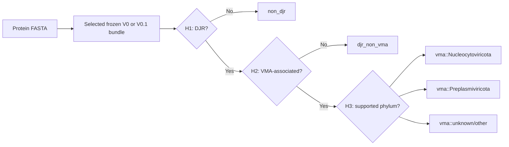
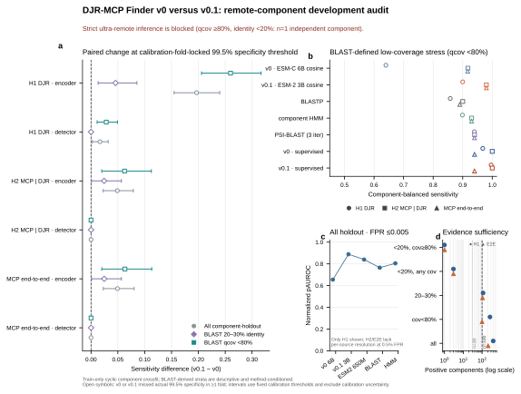

**English** | [简体中文](README.cn.md)

# DJR-MCP Finder

[](https://github.com/Hongda-Zhao/DJR-MCP-Finder/actions/workflows/ci.yml)
[](https://www.python.org/)
[](https://github.com/Hongda-Zhao/DJR-MCP-Finder/releases)
[](LICENSE)

**Detect double-jelly-roll major capsid proteins from protein FASTA files with a frozen,
three-stage protein-language-model classifier.** DJR-MCP Finder gives virologists and
bioinformaticians an auditable first-pass screen for DJR proteins, viral
morphogenesis-associated DJRs, and two supported viral phyla.

## Two current result tracks

V0 and V0.1 are both primary results of the project. They share the same three-head task but expose
different frozen encoder systems and separate command-line packages.

| Result | Frozen system | Status | User entry point |
| --- | --- | --- | --- |
| **Model V0** | ESM-C 6B for H1/H2/H3 | Released reproducible baseline | [`djrmcp-predict`](user-inference-v0/) |
| **Model V0.1** | ESM-2 3B for H1/H2; ESM-C 6B for H3 | Current mixed-encoder result; external confirmation required | [`djrmcp-predict-v01`](user-inference-v0.1/) |

Neither track trains or retunes the model during inference. V0.1 is presented alongside V0 without
rewriting the identity or evidence record of the released V0 bundle.

## From FASTA to an auditable result



`vma::unknown/other` is a reject option after H1 and H2; it is not a general unknown-virus or
out-of-distribution detector.

## Core benchmark snapshot



On the Train-only component holdout, V0.1 raises H1 encoder sensitivity from `0.734` to `0.924`
and normalized partial AUROC at FPR ≤0.005 from `0.655` to `0.889`. The task-adapted H1 detector
moves from `0.975` to `0.994`; H2 and end-to-end detector sensitivity remain tied in this audit.
These are internal, fixed-threshold development results: every paired system misses the actual
99.5% specificity target in at least one fold, and the strict `<20% identity` stratum contains only
one independent positive component. See the [benchmark package](benchmarks/ultra_remote_v0_v01/README.md)
and [scientific interpretation boundary](docs/SCIENTIFIC_EVIDENCE.md).

## Quick start: CPU-only contract checks

Python 3.12+ can validate both result tracks without downloading either encoder or PyTorch:

```bash
git clone https://github.com/Hongda-Zhao/DJR-MCP-Finder.git
cd DJR-MCP-Finder

python3.12 -m venv .venv
source .venv/bin/activate

make setup-v0 setup-v01
make test-v0 smoke-v0
make test-v01 smoke-v01
```

Native Windows has not been validated. Full inference uses Linux, Docker, and NVIDIA GPUs; follow
the [V0 workstation guide](user-inference-v0/workstation/README.md) or the
[V0.1 workstation guide](user-inference-v0.1/workstation/README.md). V0 recommends at least 24 GB
GPU memory; V0.1 uses two isolated, pinned encoder runtimes.

## Output example

Each run creates `predictions.tsv`, `run_metadata.json`, and `CHECKSUMS.sha256`. The rows below are
illustrative schema examples, not benchmark results.

| protein_id | H1 DJR probability | H2 VMA probability | H3 prediction | final_prediction |
| --- | ---: | ---: | --- | --- |
| candidate_001 | 0.997 | 0.981 | Nucleocytoviricota | `vma::Nucleocytoviricota` |
| cellular_djr_002 | 0.994 | 0.082 | not_reached | `djr_non_vma` |
| background_003 | 0.006 | 0.021 | not_reached | `non_djr` |

See the [V0](user-inference-v0/README.md) and [V0.1](user-inference-v0.1/README.md) user guides for
their complete input/output contracts.

## Releases, models, and packages

These identifiers describe different things and are intentionally not interchangeable:

| Layer | Current identifier | Meaning |
| --- | --- | --- |
| Repository release | [`v0.1.0`](https://github.com/Hongda-Zhao/DJR-MCP-Finder/releases/tag/v0.1.0) | SemVer for the GitHub software release |
| Scientific result | `model-v0` | Released all-ESM-C-6B result in [`user-inference-v0/`](user-inference-v0/) |
| Scientific result | `model-v0.1-candidate` | Current mixed-encoder result in [`user-inference-v0.1/`](user-inference-v0.1/); external confirmation required |
| Bundle revision | `model-v0-esmc6b-r1` | Immutable model contents plus export revision |
| Python distribution | for example `djrmcp-user-inference==0.1.0` | PEP 440 version of one installable package |

The complete naming contract and machine-readable mapping are in
[`docs/VERSIONING.md`](docs/VERSIONING.md) and [`release-manifest.json`](release-manifest.json).

## Choose the right path

| Goal | Start here | Environment |
| --- | --- | --- |
| Use the released V0 result | [`user-inference-v0/`](user-inference-v0/) | Python 3.10+ checks; Linux/Docker/NVIDIA for inference |
| Use the current V0.1 result | [`user-inference-v0.1/`](user-inference-v0.1/) | Python 3.12+; two isolated model runtimes |
| Audit the research workflow | [Scientific evidence](docs/SCIENTIFIC_EVIDENCE.md) | Evidence map, metrics, and claim boundary |
| Reproduce from site archives | [Reproducibility guide](docs/REPRODUCIBILITY.md) | Frozen inputs, software, and HPC resources |
| Contribute code or documentation | [`CONTRIBUTING.md`](CONTRIBUTING.md) | Python 3.12+ contributor environment |

## Contributor commands

The root `Makefile` is the canonical local interface:

```bash
python3.12 -m venv .venv
source .venv/bin/activate
make setup
make check
```

Use `make help` to see focused `setup`, `test`, `lint`, `smoke`, `build`, and package-validation
targets. CI calls the same target-level contracts.

## Documentation

- [Documentation map](docs/README.md)
- [Architecture and command inventory](docs/ARCHITECTURE.md)
- [Scientific evidence and limitations](docs/SCIENTIFIC_EVIDENCE.md)
- [Research reproducibility](docs/REPRODUCIBILITY.md)
- [Version and release naming](docs/VERSIONING.md)
- [Citation metadata](CITATION.cff)
- [Changelog](CHANGELOG.md)

## Scientific and licensing boundary

Neither V0 nor V0.1 has a new prospective external Test. Scores are calibrated under the
development-data distribution, not as prevalence-adjusted probabilities for natural proteomes.
Large-scale discovery requires independent false-positive assessment and structural/manual
validation. See [Scientific evidence](docs/SCIENTIFIC_EVIDENCE.md) before interpreting results.

Project-authored material is released under the [MIT License](LICENSE). External checkpoints,
software, datasets, database content, and trademarks retain their own terms and are not relicensed.
See [third-party notices](THIRD_PARTY_NOTICES.md) and the [security policy](SECURITY.md).
