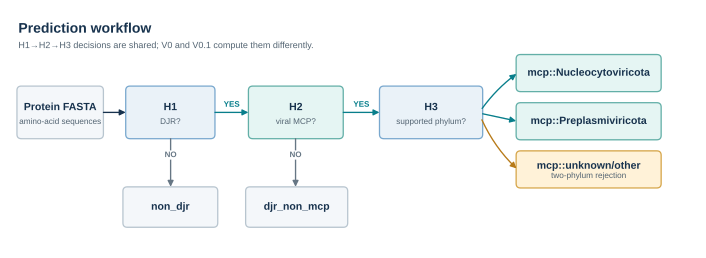
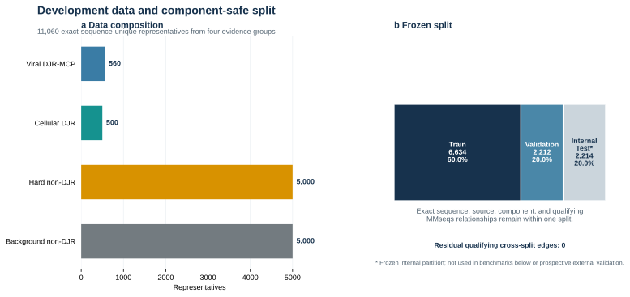
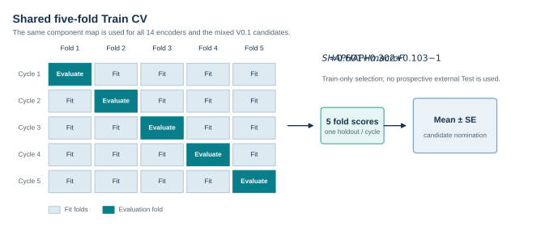
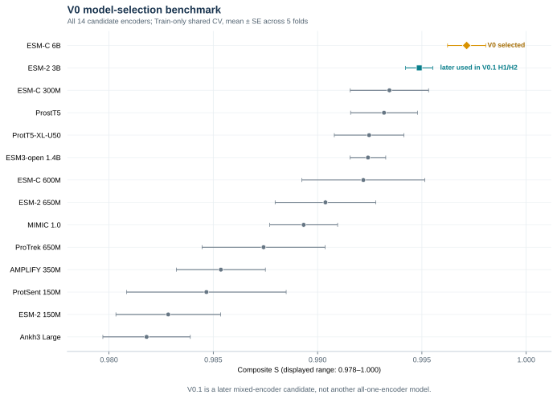
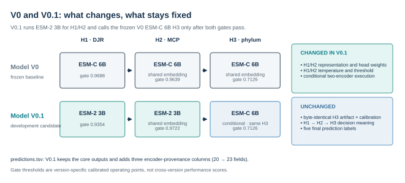
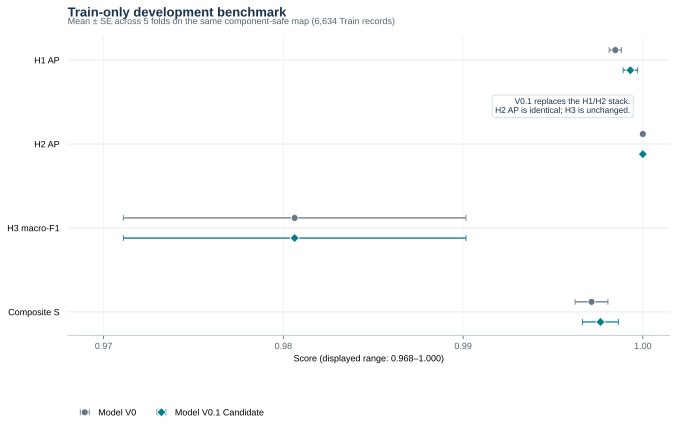
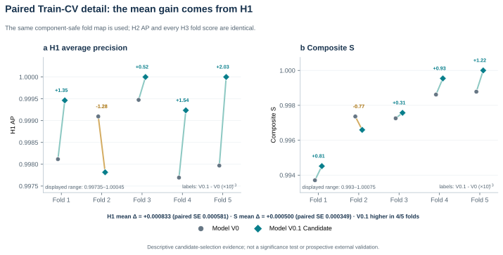

**English** | [简体中文](README.cn.md) | [日本語](README.ja.md)

# DJR-MCP Finder

**Screen protein FASTA files for double-jelly-roll major capsid protein (DJR-MCP) candidates and determine whether they belong to a supported viral phylum.**

DJR-MCPs are characteristic capsid proteins of *Varidnaviria*. Because their double-jelly-roll structural signal can remain after clear sequence similarity weakens, they are useful markers for finding and classifying diverse DNA viruses.

| Input | Output | Intended users |
| --- | --- | --- |
| Amino-acid FASTA | Per-protein DJR/MCP scores and final labels | Virologists and bioinformaticians screening viral proteins or proteins predicted from contigs |

> **Model V0.1 Candidate is recommended for new screening; Model V0 remains the released, frozen formal baseline.** V0.1 still requires independent external confirmation, while V0 remains a primary scientific result of the project.

## Prediction workflow



H2 runs only for sequences that pass H1, and H3 runs only for sequences that also pass H2. All scores, gate states, and final labels are written to `predictions.tsv`; these labels are intended for screening and do not constitute structural confirmation.

## Quick start

Recommended environment: Linux, Docker, NVIDIA Container Toolkit, and a CUDA GPU. At least 24 GB of GPU memory and BF16 support are recommended.

```bash
git clone https://github.com/Hongda-Zhao/DJR-MCP-Finder.git
cd DJR-MCP-Finder/user-inference-v0
bash workstation/build.sh

cd ../user-inference-v0.1
DJRMCP_EXPECTED_BASE_IMAGE_ID='' bash workstation/build.sh

bash workstation/run_user_fasta.sh \
  /absolute/path/to/proteins.faa \
  run_output/my_sample \
  0
```

V0.1 uses the frozen V0 image as its base, so V0 must be built first after a fresh clone. The empty value above skips only the historical Docker image-ID check, which necessarily changes after a local rebuild; version, environment, and checksum validation remain active. The prediction workflow itself is implemented in Python, while Docker isolates the two frozen environments required by H1/H2 and H3.

The first prediction downloads the pinned model checkpoints. Results are written to:

```text
run_output/my_sample/
├── predictions.tsv
├── run_metadata.json
└── CHECKSUMS.sha256
```

Possible final labels are `non_djr`, `djr_non_mcp`, `mcp::Nucleocytoviricota`, `mcp::Preplasmiviricota`, and `mcp::unknown/other`. The last label means only that a sequence passed H1 and H2 but could not be assigned reliably to either supported viral phylum by H3; it is not a general unknown-virus detector.

## Core development performance and benchmark

The development evidence is presented in the following order: data composition → evaluation design → V0 model selection → V0/V0.1 comparison.

### Development data



The four evidence groups contain 11,060 exact-sequence-unique representatives, frozen into Train 6,634, Validation 2,212, and Test 2,214. Validation and Test are frozen partitions of the development dataset; the model-selection results below use Train only and do not constitute a new prospective external Test.

### Shared five-fold design



All 14 encoders and the later mixed V0.1 candidate use the same component-safe fold map. Every component is held out for evaluation exactly once, and results are reported as the mean ± SE across five folds.

### V0 14-model benchmark



ESM-C 6B was selected as Model V0 in the all-encoder comparison. The second-ranked ESM-2 3B was later used for V0.1 H1/H2, while H3 continued to use the V0 ESM-C 6B artifact. V0.1 is therefore a mixed-encoder candidate, not a fifteenth single-encoder model in this figure.

### V0 versus V0.1: what changed

Model V0 uses one ESM-C 6B embedding to drive H1, H2, and H3. Model V0.1 Candidate uses a mixed-encoder cascade: ESM-2 3B and its own frozen H1/H2 heads, temperatures, and thresholds perform DJR/MCP screening. ESM-C 6B is run only for sequences that pass both gates, using the exact same frozen H3 phylum/reject head as V0.



| Comparison | Model V0 | Model V0.1 Candidate |
| --- | --- | --- |
| Project status | Released, frozen formal baseline | Development candidate recommended for new screening; awaiting external confirmation |
| H1/H2 | ESM-C 6B representation, heads, and calibration | ESM-2 3B representation with corresponding newly frozen heads and calibration |
| H3 | ESM-C 6B phylum/reject head | Byte-identical V0 H3 artifact and calibration |
| Execution | One encoder; final labels still follow H1→H2→H3 decisions | H2 runs only for H1-positive sequences; H3 conditionally invokes the second encoder |
| Output provenance | 20 fields in `predictions.tsv` | 23 fields, adding three head-encoder provenance fields |

The gate values in the figure are independently frozen calibration thresholds, not performance scores. A higher or lower threshold does not by itself indicate that one model is stronger or stricter. Both versions retain the same three-stage decision semantics and five final labels, while V0.1 makes execution and provenance more explicit.

#### Mean performance



The figure reports the mean ± SE across five folds; its horizontal axis is explicitly truncated to 0.968–1.000. V0.1 replaces the complete H1/H2 stack. H2 AP is exactly equal, while H3 is identical because it reuses the same artifact.

| Train-only five-fold CV ↑ | Model V0 | Model V0.1 Candidate |
| --- | ---: | ---: |
| H1 AP | `0.9985 ± 0.0003` | **`0.9993 ± 0.0004`** |
| H2 AP | `1.0000 ± 0.0000` | `1.0000 ± 0.0000` |
| H3 known-phylum macro-F1 | `0.9806 ± 0.0095` | `0.9806 ± 0.0095` |
| Composite score `S` | `0.9971 ± 0.0009` | **`0.9976 ± 0.0010`** |

`S = 0.60 × H1 AP + 0.30 × H2 AP + 0.10 × H3 macro-F1`. V0.1 increases mean H1 AP by `0.000833`. Because H2 and H3 are unchanged, the mean composite difference of `+0.000500` follows exactly from `0.60 × ΔH1`. Bold indicates candidate nomination, not statistical significance.

#### Fold-by-fold changes



V0.1 improves four of the five folds and decreases one. The paired-fold mean difference in `S` is `+0.000500`, with a paired SE of `0.000349`. This figure is descriptive candidate-selection evidence from the shared Train-CV; it is not a significance test or a new prospective external Test.

## Output example

`predictions.tsv` retains per-sequence scores, cascade states, and the final label. The following rows illustrate its field format:

| protein_id | head1_djr_probability | head2_mcp_probability | head3_prediction | final_prediction |
| --- | ---: | ---: | --- | --- |
| candidate_001 | 0.997 | 0.981 | Nucleocytoviricota | `mcp::Nucleocytoviricota` |
| cellular_djr_002 | 0.994 | 0.082 | not_reached | `djr_non_mcp` |
| background_003 | 0.006 | NA | not_reached | `non_djr` |

## Result boundaries

- Outputs are screening candidates for subsequent validation, not structural confirmation.
- The V0.1 recommendation is based on Train-only development CV and has not undergone independent external testing.
- Scores are not prevalence-adjusted probabilities for natural samples. Large-scale screens still require independent false-positive assessment and structural or manual review.

For detailed use, see the [Model V0.1 Candidate](user-inference-v0.1/README.md) and [Model V0](user-inference-v0/README.md) user guides. For data, methods, and evidence boundaries, see the [scientific evidence statement](docs/SCIENTIFIC_EVIDENCE.md).

Project-authored code and documentation are available under the [MIT License](LICENSE).
