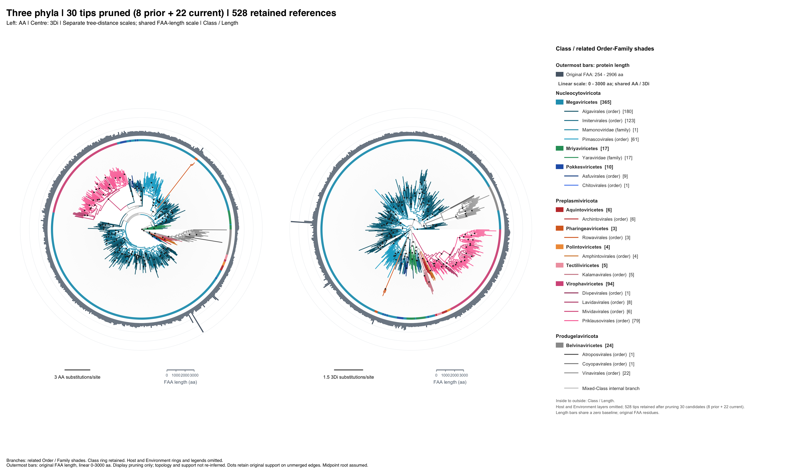

# Topology-guided exclusion and development retraining (2026-10-07)

**English** | [简体中文](README.cn.md) | [日本語](README.ja.md)

This is a completed **exploratory research experiment**, not a new model release or proof of decontamination. It records a reference-tree review, a broad user-selected exclusion set, and development-only retraining of ESM-C 6B and ESM-2 650M classifiers. No released encoder, head, threshold, routing policy or model identifier changes.

## What was done

1. Review the existing AA and 3Di trees after an initial eight-tip exclusion. The second screen covers Class and Phylum, both sides of unrooted internal edges, singleton foreign tips, supporting edges and tie-inclusive nearest neighbours.
2. Record 22 further candidates: five priority audits, four support-limited audits, three special topology reviews and ten weak/context-sensitive signals. The five priorities are Imitervirales_C0475, Priklausovirales_C0052, Priklausovirales_C0082, Asfuvirales_C0011 and Gold Chitovirales_C0003.
3. At the user's request, prune all 22, including weak signals and known structural references. The cumulative union is **30 removed / 528 retained** from 558 tree tips. These are display-pruned trees, not new FoldMason/IQ-TREE inferences. Supports originate from the original 558-tip analysis; merged-path supports are omitted. Midpoint roots can move after removing long branches.
4. Match the 30 tips by exact sequence SHA to the frozen 11,060-row model manifest. Remove only **16 Train + 7 Validation** records from all three development heads. The **7 Test** records are flagged but unchanged; no Test predictions or metrics are generated.
5. Reuse checksum-verified frozen PLM embeddings, producing verified row subsets. Fit all six classifier heads, using one newly frozen Train-only five-fold component map shared by both encoders; recalibrate on the new Validation cohort. This is not PLM fine-tuning.

The model positive pool originally has 560 representatives, including two literature-only sequences absent from the 558-tip tree. They remain. A 528-tip tree is not a Train-only dataset. This experiment's manifest contains **11,037 rows**: Train 6,618; Validation 2,205; untouched Test 2,214. VMA-DJR counts are 320 / 105 / 112, and H3 known-class counts are 305 / 100 / 106.

## Results

Train-only grouped CV means at the selected hyperparameters:

| Model | H1 AP | H2 AP | H3 macro-F1 |
| --- | ---: | ---: | ---: |
| ESM-C 6B | 0.997021 | 1.000000 | 0.994888 |
| ESM-2 650M | 0.996198 | 1.000000 | 0.912663 |

On Validation, H1 AP is 0.992544 for ESM-C 6B and 0.999746 for ESM-2 650M; H3 closed-set macro-F1 is 1.000000 versus 0.986094. Neither model dominates every head. H3 rejects four of 100 known-class Validation sequences in each model; unknown diagnostics contain only five sequences, of which four are rejected by each model, with different identities.

These are **conditional/head-wise development metrics**, not end-to-end cascade or Test performance. Hyperparameters are selected on the same CV; Validation fits calibration/thresholds. The exclusion policy was chosen after inspecting the full reference trees, including references assigned to Test. A new filename or preserved Test rows does not make that cohort prospectively untouched. No matched old-versus-filtered training experiment was performed, so these results do not establish a benefit from decontamination or justify production replacement.

## Inspect and validate

- [22-tip review](topology/review_candidates_22.tsv), [five priority audits](topology/priority_audit_5.tsv), [rank-level evidence](topology/candidate_rank_evidence.tsv), [window sensitivity](topology/window_sensitivity.tsv).
- [Cumulative 30-tip list](pruning/removed_tip_ids.txt), [528 retained tips](pruning/retained_tip_ids.txt), [tree QA](pruning/pruning_QA.tsv).
- [3Di full tree](pruning/figures/Three_Phylum_3DI_midpoint_rectangular_full_taxonomy_only.pdf), [AA full tree](pruning/figures/Three_Phylum_AA_midpoint_rectangular_full_taxonomy_only.pdf), [comparison](pruning/figures/Three_Phylum_AA_3Di_midpoint_comparison_taxonomy_only.pdf).
- [Training crosswalk](retraining/exclusion_crosswalk_30.tsv), [source mapping audit](retraining/source_manifest_audit.json), [comparison table](retraining/comparison.tsv), [result summary](retraining/RESULTS_SUMMARY.json), [preparation checks](retraining/PREPARED.json).

From the repository root, without downloading sequences, embeddings or checkpoints:

```bash
python scripts/validate_topology_exclusion_evidence.py
python -m pytest -q tests/test_topology_exclusion_evidence.py
```



## Replay boundary and provenance

`recorded_scripts/` preserves the **site-specific scripts used in this run**. They are an execution record, not portable defaults or an automatic CI workflow. They reference the originating workspace's `outputs/` layout and the archived `/aptmp/hongda/` inputs; those paths are historical provenance. A complete numerical replay requires those archives and their original sequence/embedding/model revisions, not just this compact Git bundle.

For topology replay, restore the original `Three_Phylum_RefOnly_FoldMason_IQTREE_20260924` workspace, the prior eight-tip screen and `Three_Phylum_pruned8_20261007` inputs; run `topology/recheck.R`, `topology/attachment.R`, then `topology/summarize.py` from that workspace root. R requires ape. The recorded visualization preparation uses the original trees and cumulative exclusion lists. Rendering additionally requires phangorn, ggplot2, patchwork, retained annotations/palettes, metadata and the unaligned reference FAA. Input tree hashes and QA are recorded in the manifests. Merely rotating or rerooting the tree does not change its unrooted relationships.

For training replay, use a **fresh output directory** and relocate the explicit `ROOT`, `BASE`, `ARCHIVE` and PBS run/environment roots together. Do not run the historical PBS files blindly against the completed directory. The preparation script requires the original manifest hash, all 30 exact matches, original FASTA and checksum-verified ESM-C 6B / ESM-2 650M bundles. It checks source identity and development-only exclusion, preserves Test rows, snapshots code and constructs new embedding subsets and folds. On success, run each `calibrate_benchmark_model.py` with its recorded configuration; the finalizer validates all six model checksums and metric denominators. Preserve the original benchmark's dependencies and numerical implementation recorded in `PREPARED.json` and each calibration record.

Original execution root: `/aptmp/hongda/DJR-MCP-Finder/experiments/pruned30_dev_20261007`. PBS jobs 5147398 / 5147399 / 5147400 completed with Exit 0 (33 / 17 / 13 seconds). Workstation rx1000 was available, but the CPU jobs had already completed before migration. Raw sequences, embeddings, checkpoint files, compute environments and individual Test predictions are **not included**. Model-path strings and source-code hashes describe server-side artifacts; the compact validator checks their recorded provenance, not the unavailable checkpoint bytes.

`CHECKSUMS.sha256` covers this compact bundle. It is separate from production release checksums. New model use must pair a head with its own calibration and encoder contract; old thresholds cannot be silently reused. The previously pending same-Class Order conflicts remain outside this Class/Phylum review.
