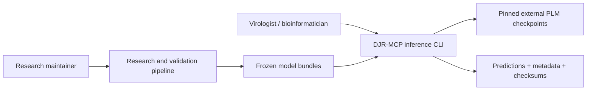
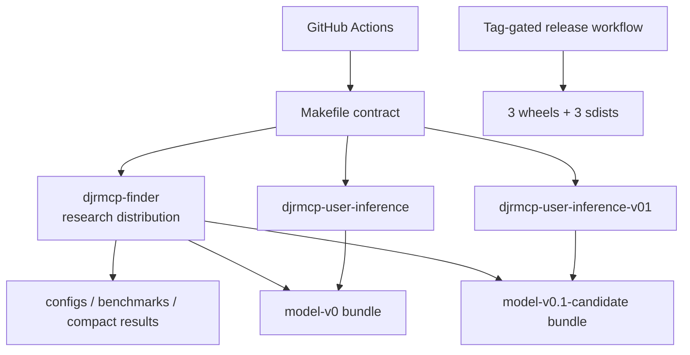
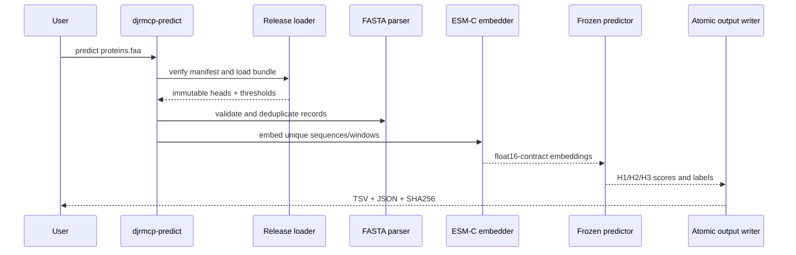

# DJR-MCP Finder 架构与仓库导航

[English](ARCHITECTURE.md) | **简体中文** | [日本語](ARCHITECTURE.ja.md)

本文档说明仓库的代码区域、运行入口、验证命令与科研边界，用于上手和维护，但不能取代 [`WORKFLOW_V0.md`](research/WORKFLOW_V0.md) 中的科研方案。

## 第 1 部分 — 全仓库技术详解

### 仓库是什么

DJR-MCP Finder 是一条 Python 科研流程，并包含两个面向用户的推理包。已发布路径接收 protein FASTA、计算固定版本的 ESM-C embedding、应用冻结的 H1→H2→H3 cascade，并写出带元数据和 checksum 的预测结果（[README](../README.md#L10-L17)）。Candidate 包替换了 H1/H2 encoder，但明确不属于已发布的科学模型身份（[发布清单](../release-manifest.json#L34-L50)）。

### 检测到的技术栈

| 层次 | 技术 | 本地依据 |
| --- | --- | --- |
| 语言 | Python 3.10+；完整贡献者/Candidate 环境使用 Python 3.12+ | [根目录元数据](../pyproject.toml#L5-L10)、[Candidate 元数据](../user-inference-v0.1/pyproject.toml#L5-L18) |
| 打包 | PEP 517/621、setuptools、`src/` 布局、三个 distribution | [根目录元数据](../pyproject.toml#L1-L10)、[发布清单](../release-manifest.json#L8-L32) |
| 数值/数据 | NumPy、pandas、scikit-learn、Biopython、joblib、PyYAML | [依赖项](../pyproject.toml#L42-L49) |
| 模型运行时 | PyTorch、Hugging Face/Biohub Transformers、隔离的 Candidate 运行时 | [extras](../pyproject.toml#L52-L67)、[Candidate Dockerfile](../user-inference-v0.1/workstation/Dockerfile#L7-L29) |
| 测试/lint/构建 | pytest、Ruff、PyPA build、Twine、Make | [开发依赖](../pyproject.toml#L71-L77)、[Makefile](../Makefile#L33-L73) |
| CI/Release | GitHub Actions；由 tag 触发的 GitHub Release artifact | [CI](../.github/workflows/ci.yml#L16-L129)、[Release workflow](../.github/workflows/release.yml#L17-L89) |
| 存储 | 文件系统 artifact：FASTA、TSV/JSON、NPZ、checksum manifest | [输出示例](../README.md#L65-L76)、[bundle package data](../user-inference-v0/pyproject.toml#L68-L75) |

### 入口点

| 入口点 | 用途 | 依据 |
| --- | --- | --- |
| `djrmcp` | 科研 workflow 计划和 Benchmark embedding CLI | [脚本注册](../pyproject.toml#L79-L80)、[CLI parser](../src/djrmcp_finder/cli.py#L67) |
| `python scripts/run_v0_dataset.py` | V0 数据集构建的可移植根入口 | [Python runner](../scripts/run_v0_dataset.py) |
| `python scripts/run_postsplit_integrity_audit.py` | split 后完整性审计的可移植根入口 | [Python runner](../scripts/run_postsplit_integrity_audit.py) |
| `djrmcp-predict` | 已发布 Model V0 的 FASTA 验证、模型检查与预测 | [脚本注册](../user-inference-v0/pyproject.toml#L55-L56)、[CLI main](../user-inference-v0/src/djrmcp_predict/cli.py#L189) |
| `djrmcp-predict-v01` | 使用隔离 worker 的 Candidate controller CLI | [脚本注册](../user-inference-v0.1/pyproject.toml#L49-L50)、[CLI main](../user-inference-v0.1/src/djrmcp_predict_v01/cli.py#L403) |
| 工作站 wrapper | Docker 构建、缓存、GPU 选择和离线执行 | [正式指南](../user-inference-v0/workstation/README.md)、[Candidate 指南](../user-inference-v0.1/workstation/README.md) |

预测 CLI 和工作站 wrapper 不需要 PBS 或 `qsub`。上面两个根目录科研 runner 也可在没有调度器的环境运行；资源密集阶段仍需提供其声明的数据、软件、内存及适用时的 GPU。

### 命令与验证清单

根目录 Makefile 是命令的权威来源；CI 调用其中聚焦的 target，而不会重复定义测试语义。

| 命令 | 用途 | 依据 |
| --- | --- | --- |
| `make setup` | 在 Python 3.12+ 下安装全部三个开发 distribution | [Makefile](../Makefile#L18-L21) |
| `make setup-core` / `setup-v0` / `setup-v01` | 安装其中一个使用界面 | [Makefile](../Makefile#L23-L31) |
| `make metadata` | 检查 Release/包/模型/bundle 映射 | [Makefile](../Makefile#L33-L34) |
| `make docs-check` | 检查必需文档、README 大小和本地链接 | [Makefile](../Makefile#L36-L37) |
| `make lint` | 运行关键的 Ruff 正确性规则 | [Makefile](../Makefile#L39-L40) |
| `make test` | 运行核心、正式和 Candidate 测试套件 | [Makefile](../Makefile#L42-L51) |
| `python -m pytest -q tests/test_cli.py` | 运行一个聚焦的测试模块 | [核心测试 target](../Makefile#L42-L43)、[示例模块](../tests/test_cli.py) |
| `make smoke` | 无需下载模型即可验证两个 FASTA parser 和冻结 bundle | [Makefile](../Makefile#L53-L61) |
| `make build` | 构建三个 wheel 和三个 sdist | [Makefile](../Makefile#L63-L67) |
| `make package-check` | 运行 Twine，并检查许可证、typed marker、notice 和元数据 | [Makefile](../Makefile#L69-L71) |
| `make check` | 完整的本地 CI 等价门槛 | [Makefile](../Makefile#L73) |

CI 会在 push 到 `main`、pull request 和手动触发时运行（[CI 触发器](../.github/workflows/ci.yml#L3-L7)）。它覆盖根目录包和正式包声明的全部 Python 版本、两个 Candidate 版本、元数据/文档、lint、smoke 检查以及构建后的 distribution（[CI jobs](../.github/workflows/ci.yml#L16-L129)）。

该 workflow 定义仓库的自动验证范围。相关 job 是否被配置为阻止合并的 required check，由 GitHub 仓库设置控制，不能仅凭 checkout 中的文件断言。

### 目录布局

| 路径 | 用途 |
| --- | --- |
| `src/djrmcp_finder/` | 科研配置、embedding、分类器选择/校准、验证和 Test ledger |
| `tests/` | 核心科研流程测试 |
| `scripts/` | 可移植的 Python 科研 runner、流程阶段、validator、图表和工程约定检查 |
| `configs/` | 冻结的或以便携方式渲染的 workflow 配置 |
| `user-inference-v0/` | 已发布的 `model-v0` 包和工作站部署 |
| `user-inference-v0.1/` | `model-v0.1-candidate` controller、worker 和工作站部署 |
| `benchmarks/` | 与 checksum 绑定的精简 Benchmark 证据，包括可选的历史 HPC 重放 launcher |
| `results/` | 小型已发布结果身份和图表；大型生成结果继续排除在外 |
| `docs/` | 工程、版本、科研解释和可复现性文档 |
| `.github/` | CI/Release 自动化与贡献模板 |

### 部署与运行界面

| 界面 | 固定版本或约束 | 依据 |
| --- | --- | --- |
| 根目录/正式包最低版本 | Python `>=3.10` | [根目录](../pyproject.toml#L10)、[正式包](../user-inference-v0/pyproject.toml#L18) |
| Candidate 包最低版本 | Python `>=3.12`、NumPy `==2.5.1` | [Candidate](../user-inference-v0.1/pyproject.toml#L18-L40) |
| CI runner | Python 3.10–3.13 和当前 GitHub action major 版本 | [CI matrix](../.github/workflows/ci.yml#L46-L108) |
| 正式容器 | `ubuntu:24.04`；固定 setuptools、wheel、NumPy、PyTorch 和 Biohub commit | [正式 Dockerfile](../user-inference-v0/workstation/Dockerfile#L1-L2)、[运行时安装](../user-inference-v0/workstation/Dockerfile#L43-L54) |
| Candidate 容器 | 基于正式 V0；另含采用固定 Transformers 的 Python 3.12 环境 | [Candidate Dockerfile](../user-inference-v0.1/workstation/Dockerfile#L1-L9)、[overlay](../user-inference-v0.1/workstation/Dockerfile#L24-L57) |
| Release runner | Python 3.12；tag 必须位于 `main` | [Release workflow](../.github/workflows/release.yml#L38-L56) |

本仓库不部署服务数据库、Web server、queue 或 authentication layer。大型外部模型/数据依赖是文件系统或缓存输入，而非后端服务。

### 生命周期与依赖扫描

- GitHub Actions 版本在 workflow 文件中保持明确，并应在每次 Release 时复核。
- 无法通过 checkout 验证 Python 3.10 的生命周期状态，标记为 `[UNVERIFIED]`。由于它是最低公开版本，维护者应在下一个 minor Release 前核查其上游安全支持结束日期。
- 正式运行时有意固定一个 Biohub Transformers Git commit。这是可复现性约束，并非通用依赖范围；安全更新需要新的已验证 bundle，而不能未经审查直接升级。
- Candidate 的精确 NumPy 版本和两个 Transformers 运行时是应用层的可复现性固定版本。不得将它们复制到根目录 library 的依赖策略中。

### 数据、API、job 与测试

项目没有自有网络 API。外部模型与数据库访问发生在用户或研究人员明确执行命令时。数据约定包括 FASTA 输入、冻结的 JSON/NPZ/checksum bundle 文件、TSV/JSON 预测输出，以及与 checksum 绑定的 Benchmark 记录。根目录科研流程通过可移植的 Python 入口启动，不需要内部后台 job 服务或强制调度器。与 checksum 绑定的 `benchmarks/*/pbs/` 文件只保留为可选的历史 HPC 重放证据，不是普通 FASTA 预测的依赖。

测试策略包含三个独立套件和仅 CPU 的 smoke 检查。GPU 推理与完整归档重放仍属于工作站/HPC 验证，因为其 checkpoint 和冻结数据库不在精简 checkout 中（[可复现性矩阵](REPRODUCIBILITY.md#what-can-be-reproduced-locally)）。

## 第 2 部分 — 上下文与生态系统

### 仓库范围

| 字段 | 值 |
| --- | --- |
| 仓库 | `Hongda-Zhao/DJR-MCP-Finder` |
| 主要功能 | 从 protein FASTA 中筛选 DJR-MCP candidate，并判断支持的病毒门类 |
| 优先实验候选模型 | Model V0.1 Candidate；仍待独立外部验证 |
| 可复现基线 | 已发布且冻结的 Model V0 |
| 仓库 Release | `v0.1` |
| 许可证 | 有范围限定的 MIT；外部资产保留其上游条款 |

### 仓库控制措施

- [`Makefile`](../Makefile#L33-L73) 集中定义元数据、文档、lint、测试、smoke 和打包门槛。
- [CI](../.github/workflows/ci.yml#L16-L128) 在支持的包与 Python 版本范围内运行这些门槛。
- [Pull request 模板](../.github/pull_request_template.md) 要求 reviewer 检查模型身份、checksum、结论、输入安全和敏感数据。
- [Issue 模板](../.github/ISSUE_TEMPLATE/) 将可复现 bug、功能请求与科研解释问题分开处理。
- 机器可读的 Release 清单可防止仅在文字中修改版本（[清单](../release-manifest.json#L1-L51)）。

### 贡献者注意事项

- `make setup` 需要 Python 3.12，因为它会安装 Candidate；较小的 target 在声明支持的位置可使用 Python 3.10（[Makefile](../Makefile#L18-L31)）。
- 完整推理会下载大型 checkpoint，并需要固定的运行时环境；普通测试和 smoke 检查则不需要。
- 历史绝对路径属于溯源信息。请渲染站点本地配置，不要原地替换这些路径（[可复现性指南](REPRODUCIBILITY.md#frozen-provenance)）。
- 在冻结 bundle 内只修改文档，也可能使其 checksum manifest 失效。
- `build/`、`dist/`、缓存、环境、大型 array 和 checkpoint 均被忽略；Release artifact 来自 CI，而不是已提交的构建目录。

### 从磁盘可见的生态关系

项目使用 Biohub ESM-C、Meta ESM-2、PyTorch、Transformers、Biopython 和经典生物信息学输出。这些仍是上游依赖，而非 vendored 服务。正式包和 Candidate 包可分别部署，而根目录科研包保留生成其冻结 head 的选择与评估 workflow。

## 第 3 部分 — 架构蓝图

### Level 1：系统上下文

### Level 2：仓库容器

### Level 3：正式预测生命周期

Loader 会在构建 Release 前验证 bundle checksum manifest（[Release loader](../user-inference-v0/src/djrmcp_predict/release.py#L35)、[bundle 加载](../user-inference-v0/src/djrmcp_predict/release.py#L194)）。FASTA 验证是独立边界（[parser](../user-inference-v0/src/djrmcp_predict/fasta.py#L79)），而 predictor 管理冻结 cascade（[predictor](../user-inference-v0/src/djrmcp_predict/predictor.py#L18)）。

### 分层与依赖规则

1. CLI module 负责编排，但不重新定义模型常量。
2. Release loader 在 predictor 接收权重前验证并解析 bundle 元数据。
3. FASTA parsing 独立于模型运行时，因此验证和 smoke 检查可以只用 CPU。
4. Predictor 依赖冻结 Release 对象和 embedding array，而不依赖科研训练代码。
5. 输出 writer 负责原子文件创建和结果 checksum。
6. Candidate worker 隔离不兼容的模型运行时；controller 只将通过 gate 的序列路由到 ESM-C worker（[Candidate worker 启动](../user-inference-v0.1/src/djrmcp_predict_v01/cli.py#L150)、[Candidate 预测](../user-inference-v0.1/src/djrmcp_predict_v01/cli.py#L212)）。

这些规则通过包隔离、冻结 bundle schema/checksum、测试和 CI 强制执行，而非通过独立的 architecture-lint 工具。

### 横切关注点

| 关注点 | 实现 | 依据 |
| --- | --- | --- |
| Authentication | 无；仅本地 CLI | 包入口点中没有服务/API 界面 |
| 配置 | JSON/YAML 加环境变量路径渲染 | [可复现性指南](REPRODUCIBILITY.md#portable-checkout) |
| 完整性 | 模型加载前和结果写入后使用 SHA-256 manifest | [正式 loader](../user-inference-v0/src/djrmcp_predict/release.py#L35) |
| 错误处理 | 通过 exception 和非零 CLI exit 实现 fail-closed 验证 | [正式 CLI](../user-inference-v0/src/djrmcp_predict/cli.py#L117) |
| 日志/元数据 | 结构化运行元数据和明确的命令输出 | [输出约定](../README.md#L65-L76) |
| Secret | 不嵌入凭据；外部缓存/归档通过路径提供 | [环境模板](../.env.example#L1-L15)、[审查 checklist](../.github/pull_request_template.md#L30-L33) |
| Feature flag | 用于设备、缓存、离线模式和便携根目录的环境变量 | [正式指南](../user-inference-v0/README.md) |
| 可观测性 | 运行时元数据、checksum、验证 JSON；无 telemetry 服务 | [正式 Docker 环境](../user-inference-v0/workstation/Dockerfile#L7-L15) |

### 推断出的架构决策

#### ADR：保持已发布推理包与 Candidate 推理包分离

- **背景：** Candidate 使用彼此不兼容的 Transformers 环境，且证据较弱。
- **决策：** 分离 distribution、import namespace、CLI、bundle 和容器。
- **替代方案：** 使用运行时开关的单一包会模糊状态，并增加依赖冲突。
- **后果：** 会存在部分重复的 controller 代码，但溯源更明确，安装更安全。

#### ADR：反序列化前验证冻结 artifact

- **背景：** 分类器 head 和科研元数据必须保持 content-addressed。
- **决策：** 加载前验证 manifest hash，并分发不使用 pickle 的 NPZ head。
- **替代方案：** 按路径信任文件更简单，但无法检测变更。
- **后果：** 修改 notice/模型卡也需要刷新 checksum。

#### ADR：使用静态包版本和跨层清单

- **背景：** 三个 distribution 和两个科学模型身份不共享同一个生命周期。
- **决策：** 为每个 distribution 保留 PEP 440 版本，并集中验证其映射。
- **替代方案：** 单一 Git 派生版本会错误地暗示每个模型/包都已一同变更。
- **后果：** Release 准备需要更新一份小型清单，并由 CI 强制验证。

### 治理与 Release 强制执行

CI 会在 push 和 pull request 上运行已记录的验证 job。是否阻止合并由仓库设置控制，而不是由受版本控制的 workflow 单独决定。Tag Release workflow 会验证 tag 语法、发布者身份、`main` 上的祖先关系、清单一致性、Twine 元数据、wheel/sdist 内容，然后在 Release job 中仅使用 `contents: write` 权限附加 artifact（[Release 门槛](../.github/workflows/release.yml#L17-L89)）。在配置 OIDC Trusted Publishing 和受保护 environment 前，PyPI 有意不包含在当前 workflow 中。

### 如何添加功能

1. 确认变更属于科研包、正式推理还是 Candidate。
2. 保持模型/证据身份不变，除非科研 Release 门槛明确授权建立新身份。
3. 在对应测试套件中添加测试，并尽可能提供仅 CPU 的 smoke 路径。
4. 如果任何标识符发生变化，更新用户文档、[变更日志](repository/CHANGELOG.md) 和 `release-manifest.json`。
5. 先运行聚焦的 `make` target，再运行 `make check`。
6. 使用 [Pull request 模板](../.github/pull_request_template.md) 记录科研、checksum、输入安全与数据影响，并要求相关 CI job 通过。

## 子系统详解

### 科研选择与 Test ledger

科研 CLI 提供 workflow 计划和 embedding 阶段（[CLI](../src/djrmcp_finder/cli.py#L67-L114)）。Embedding 会加载 manifest/FASTA 记录、应用固定的长序列窗口策略，并写出可续传的 content-addressed 输出（[记录](../src/djrmcp_finder/stages/embedding.py#L87)、[窗口](../src/djrmcp_finder/stages/embedding.py#L131)、[阶段](../src/djrmcp_finder/stages/embedding.py#L237)）。分类器代码将校准与唯一一条受保护的 Test 路径分离，并具有明确的授权和 ledger 状态（[校准](../src/djrmcp_finder/stages/classifier.py#L1689)、[授权](../src/djrmcp_finder/stages/classifier.py#L1900)、[Test 评估](../src/djrmcp_finder/stages/classifier.py#L2194)）。这是最敏感的科研边界：普通工程变更不得建立绕过路径。

### 已发布推理包

正式 CLI 会解析默认内置 Release、验证 checksum 身份、解析 FASTA、对去重后的序列进行 embedding、运行冻结 predictor，并原子写入输出。包有意将模型下载放在可选 inference extra 中；测试和模型检查只需 NumPy（[正式元数据](../user-inference-v0/pyproject.toml#L39-L53)）。正是这种分离使 CI 无需 GPU 即可证明输入和 bundle 约定。

### Candidate controller 与 worker

Candidate bundle 将 H1/H2 映射到 ESM-2 3B，将 H3 映射到 ESM-C 6B。Controller 验证一个 bundle，通过单独选择的 Python interpreter 启动 worker，并只将 H1/H2 阳性序列路由到 H3。Worker 是明确的 CLI 进程边界（[worker parser](../user-inference-v0.1/src/djrmcp_predict_v01/worker.py#L251)、[worker main](../user-inference-v0.1/src/djrmcp_predict_v01/worker.py#L263)）。派生容器保留已验证的 V0 环境，同时叠加不兼容的 ESM-2 环境（[容器设计](../user-inference-v0.1/workstation/Dockerfile#L7-L29)）。剩余风险属于科研层面，而不仅是技术层面：精确 parity 和无误路由并不构成外部确认。

## 置信度评估

| 结论领域 | 置信度 | 依据 |
| --- | --- | --- |
| 包名、版本、入口点 | 高 | 已解析本地 `pyproject.toml` 和 Release 清单 |
| CLI/数据流 | 高 | 本地源码与测试 |
| 容器/运行时固定版本 | 高 | 本地 Dockerfile 与验证记录 |
| 科研证据状态 | 高 | 冻结 bundle 元数据与 workflow 文档 |
| CI job 覆盖范围 | 高 | 本地 workflow 文件 |
| 阻止合并的策略 | 未作断言 | Required check 与分支保护属于 checkout 之外的仓库设置 |
| 外部依赖生命周期 | 未验证 | 必须根据上游 Release/支持策略复核 |
| 完整归档重放 | 推断/有条件 | 需要本地没有提供的外部 checksum 绑定归档 |

## 脚注 — 关键本地来源

- [`README.md`](../README.md) 确立用户价值、公开 workflow 和解释边界。
- [`release-manifest.json`](../release-manifest.json) 确立跨层身份。
- [`Makefile`](../Makefile) 确立规范开发命令。
- [`pyproject.toml`](../pyproject.toml) 和两个推理 manifest 确立包/运行时界面。
- [`.github/workflows/ci.yml`](../.github/workflows/ci.yml) 和 [`.github/workflows/release.yml`](../.github/workflows/release.yml) 确立自动化。
- [`WORKFLOW_V0.md`](research/WORKFLOW_V0.md) 确立科研方案和 Test 边界。
- 正式版和 Candidate 的 `release.json` 文件确立冻结 bundle 约定与状态。
