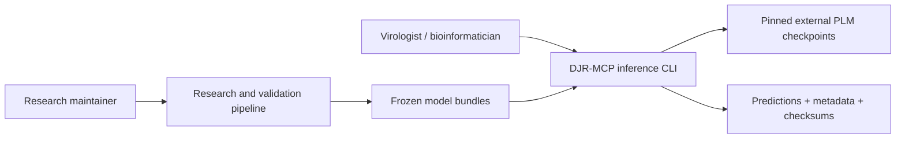
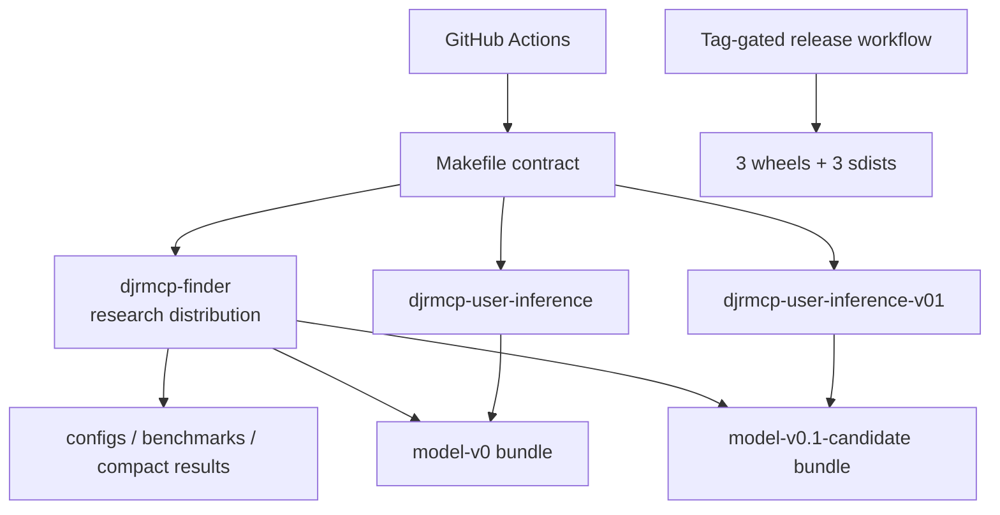
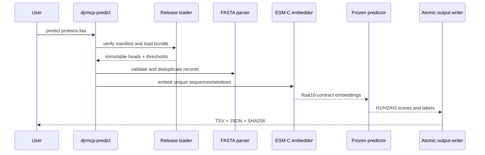

# DJR-MCP Finder のアーキテクチャとリポジトリマップ

[English](ARCHITECTURE.md) | [简体中文](ARCHITECTURE.cn.md) | **日本語**

この文書は、リポジトリ内のコード領域、実行エントリーポイント、検証コマンド、科学的境界を整理します。オンボーディングと保守を支援するためのものであり、[`WORKFLOW_V0.md`](research/WORKFLOW_V0.md) に記載された科学的プロトコルに代わるものではありません。

## Part 1 — リポジトリ全体の技術詳細

### このリポジトリについて

DJR-MCP Finder は、Python の研究 pipeline と二つのユーザー向け推論パッケージで構成されます。リリース済み経路は protein FASTA を受け取り、固定バージョンの ESM-C embedding を計算し、固定された H1→H2→H3 cascade を適用して、メタデータと checksum 付きの予測を書き出します（[README](../README.md#L10-L17)）。Candidate パッケージは H1/H2 encoder を置き換えますが、リリース済みの科学的識別子には明示的に含まれません（[リリースマニフェスト](../release-manifest.json#L34-L50)）。

### 検出されたスタック

| レイヤー | 技術 | ローカルでの根拠 |
| --- | --- | --- |
| 言語 | Python 3.10+。完全なコントリビューター／Candidate 環境は Python 3.12+ | [ルートメタデータ](../pyproject.toml#L5-L10)、[Candidate メタデータ](../user-inference-v0.1/pyproject.toml#L5-L18) |
| パッケージング | PEP 517/621、setuptools、`src/` レイアウト、三つの distribution | [ルートメタデータ](../pyproject.toml#L1-L10)、[リリースマニフェスト](../release-manifest.json#L8-L32) |
| 数値／データ | NumPy、pandas、scikit-learn、Biopython、joblib、PyYAML | [依存関係](../pyproject.toml#L42-L49) |
| モデルランタイム | PyTorch、Hugging Face/Biohub Transformers、分離された Candidate ランタイム | [extras](../pyproject.toml#L52-L67)、[Candidate Dockerfile](../user-inference-v0.1/workstation/Dockerfile#L7-L29) |
| テスト／lint／ビルド | pytest、Ruff、PyPA build、Twine、Make | [開発依存関係](../pyproject.toml#L71-L77)、[Makefile](../Makefile#L33-L73) |
| CI／リリース | GitHub Actions。タグで制御される GitHub Release artifact | [CI](../.github/workflows/ci.yml#L16-L129)、[リリース workflow](../.github/workflows/release.yml#L17-L89) |
| ストレージ | ファイルシステム上の artifact：FASTA、TSV/JSON、NPZ、checksum manifest | [出力例](../README.md#L65-L76)、[bundle package data](../user-inference-v0/pyproject.toml#L68-L75) |

### エントリーポイント

| エントリーポイント | 用途 | 根拠 |
| --- | --- | --- |
| `djrmcp` | 研究 workflow の計画と Benchmark embedding CLI | [スクリプト登録](../pyproject.toml#L79-L80)、[CLI parser](../src/djrmcp_finder/cli.py#L67) |
| `python scripts/run_v0_dataset.py` | V0 dataset 構築の可搬な root entrypoint | [Python runner](../scripts/run_v0_dataset.py) |
| `python scripts/run_postsplit_integrity_audit.py` | split 後の整合性監査を行う可搬な root entrypoint | [Python runner](../scripts/run_postsplit_integrity_audit.py) |
| `djrmcp-predict` | リリース済み Model V0 の FASTA 検証、モデル確認、予測 | [スクリプト登録](../user-inference-v0/pyproject.toml#L55-L56)、[CLI main](../user-inference-v0/src/djrmcp_predict/cli.py#L189) |
| `djrmcp-predict-v01` | 分離 worker を使用する Candidate controller CLI | [スクリプト登録](../user-inference-v0.1/pyproject.toml#L49-L50)、[CLI main](../user-inference-v0.1/src/djrmcp_predict_v01/cli.py#L403) |
| ワークステーション wrapper | Docker ビルド、キャッシュ、GPU 選択、オフライン実行 | [正式版ガイド](../user-inference-v0/workstation/README.md)、[Candidate ガイド](../user-inference-v0.1/workstation/README.md) |

予測 CLI と workstation wrapper に PBS や `qsub` は不要です。上記二つの root 研究 runner も scheduler なしで動作しますが、resource-intensive な段階では、宣言済みのデータ、ソフトウェア、メモリ、および必要に応じて GPU を用意する必要があります。

### コマンドと検証の一覧

ルート Makefile がコマンドの正規情報源です。CI はテストの意味を重複定義せず、用途別の target を呼び出します。

| コマンド | 用途 | 根拠 |
| --- | --- | --- |
| `make setup` | Python 3.12+ で三つの開発 distribution をすべてインストール | [Makefile](../Makefile#L18-L21) |
| `make setup-core` / `setup-v0` / `setup-v01` | いずれか一つの利用面をインストール | [Makefile](../Makefile#L23-L31) |
| `make metadata` | リリース／パッケージ／モデル／bundle の対応を確認 | [Makefile](../Makefile#L33-L34) |
| `make docs-check` | 必須文書、README のサイズ、ローカルリンクを確認 | [Makefile](../Makefile#L36-L37) |
| `make lint` | 重要な Ruff 正確性ルールを実行 | [Makefile](../Makefile#L39-L40) |
| `make test` | コア、正式版、Candidate のテストスイートを実行 | [Makefile](../Makefile#L42-L51) |
| `python -m pytest -q tests/test_cli.py` | 対象を絞ったテストモジュールを一つ実行 | [コアテスト target](../Makefile#L42-L43)、[サンプルモジュール](../tests/test_cli.py) |
| `make smoke` | モデルをダウンロードせず、両方の FASTA parser と固定 bundle を検証 | [Makefile](../Makefile#L53-L61) |
| `make build` | 三つの wheel と三つの sdist を構築 | [Makefile](../Makefile#L63-L67) |
| `make package-check` | Twine を実行し、ライセンス、typed marker、notice、メタデータを確認 | [Makefile](../Makefile#L69-L71) |
| `make check` | 完全なローカル CI 相当ゲート | [Makefile](../Makefile#L73) |

CI は `main` への push、pull request、手動 dispatch で実行されます（[CI trigger](../.github/workflows/ci.yml#L3-L7)）。ルートおよび正式版パッケージで宣言された全 Python バージョン、Candidate の二つのバージョン、メタデータ／文書、lint、smoke check、構築済み distribution を対象とします（[CI jobs](../.github/workflows/ci.yml#L16-L129)）。

この workflow は、リポジトリの自動検証範囲を定義します。各 job が merge を阻止する required check として設定されているかどうかは GitHub のリポジトリ設定で管理され、checkout 内のファイルだけからは断定しません。

### ディレクトリ構成

| パス | 用途 |
| --- | --- |
| `src/djrmcp_finder/` | 研究設定、embedding、分類器の選択／calibration、検証、Test ledger |
| `tests/` | コア研究 pipeline のテスト |
| `scripts/` | 可搬な Python 研究 runner、pipeline stage、validator、図、エンジニアリング規約チェック |
| `configs/` | 固定済みまたはポータブルにレンダリングされた workflow 設定 |
| `user-inference-v0/` | リリース済み `model-v0` パッケージとワークステーション展開 |
| `user-inference-v0.1/` | `model-v0.1-candidate` controller、worker、ワークステーション展開 |
| `benchmarks/` | checksum に結び付けられたコンパクトな Benchmark エビデンス。任意の歴史的 HPC replay launcher を含む |
| `results/` | 小規模な公開済み結果識別子と図。大規模な生成結果は引き続き除外 |
| `docs/` | エンジニアリング、バージョン、科学的解釈、再現性に関する文書 |
| `.github/` | CI／リリース自動化とコントリビューションテンプレート |

### デプロイとランタイムの利用面

| 利用面 | 固定バージョンまたは制約 | 根拠 |
| --- | --- | --- |
| ルート／正式版パッケージの最小要件 | Python `>=3.10` | [ルート](../pyproject.toml#L10)、[正式版](../user-inference-v0/pyproject.toml#L18) |
| Candidate パッケージの最小要件 | Python `>=3.12`、NumPy `==2.5.1` | [Candidate](../user-inference-v0.1/pyproject.toml#L18-L40) |
| CI runner | Python 3.10–3.13 と現在の GitHub action major | [CI matrix](../.github/workflows/ci.yml#L46-L108) |
| 正式版コンテナ | `ubuntu:24.04`。setuptools、wheel、NumPy、PyTorch、Biohub commit を固定 | [正式版 Dockerfile](../user-inference-v0/workstation/Dockerfile#L1-L2)、[ランタイムインストール](../user-inference-v0/workstation/Dockerfile#L43-L54) |
| Candidate コンテナ | 正式版 V0 から派生。固定 Transformers を使う二つ目の Python 3.12 環境 | [Candidate Dockerfile](../user-inference-v0.1/workstation/Dockerfile#L1-L9)、[overlay](../user-inference-v0.1/workstation/Dockerfile#L24-L57) |
| リリース runner | Python 3.12。tag は `main` 上に存在する必要がある | [リリース workflow](../.github/workflows/release.yml#L38-L56) |

このリポジトリは、サービスデータベース、Web server、queue、authentication layer を展開しません。大規模な外部モデル／データ依存関係は、バックエンドサービスではなく、ファイルシステム／キャッシュ入力です。

### ライフサイクルと依存関係の確認

- GitHub Actions のバージョンは workflow ファイルに明記され、各リリース時に見直す必要があります。
- Python 3.10 のライフサイクル状態は checkout から確認できないため、`[UNVERIFIED]` です。公開最小バージョンであるため、メンテナーは次の minor リリース前に上流のセキュリティサポート終了日を確認する必要があります。
- 正式版ランタイムは、Biohub Transformers の Git commit を意図的に固定します。これは再現性の制約であって一般的な依存範囲ではありません。セキュリティ修正には、未検証の更新ではなく、新しい検証済み bundle が必要です。
- Candidate で厳密に固定された NumPy と二つの Transformers ランタイムは、アプリケーションレベルの再現性固定です。ルート library の依存関係ポリシーにコピーしてはいけません。

### データ、API、job、テスト

プロジェクト独自のネットワーク API はありません。外部モデルとデータベースへのアクセスは、ユーザーまたは研究者が明示的にコマンドを実行したときに発生します。データ規約は、FASTA 入力、固定された JSON/NPZ/checksum bundle ファイル、TSV/JSON 予測出力、checksum に結び付けられた Benchmark 記録です。root の研究 workflow は可搬な Python entrypoint から開始され、内部 background-job service や必須 scheduler を必要としません。checksum-bound の `benchmarks/*/pbs/` は、任意の歴史的 HPC replay evidence としてのみ保持され、通常の FASTA 予測には依存しません。

テスト戦略は三つの独立スイートと CPU のみの smoke check で構成されます。GPU 推論と完全アーカイブの再実行は、checkpoint と固定データベースがコンパクト checkout に含まれないため、引き続きワークステーション／HPC 検証です（[再現性マトリクス](REPRODUCIBILITY.md#what-can-be-reproduced-locally)）。

## Part 2 — コンテキストとエコシステム

### リポジトリの範囲

| フィールド | 値 |
| --- | --- |
| リポジトリ | `Hongda-Zhao/DJR-MCP-Finder` |
| 主な機能 | protein FASTA から DJR-MCP candidate をスクリーニングし、対応するウイルス門を判定 |
| 推奨スクリーニングモデル | Model V0.1 Candidate |
| 正式ベースライン | リリース済みで固定された Model V0 |
| リポジトリリリース | `v0.1` |
| ライセンス | 適用範囲を限定した MIT。外部 asset は上流の条件を維持 |

### リポジトリの管理手段

- [`Makefile`](../Makefile#L33-L73) は、メタデータ、文書、lint、テスト、smoke、パッケージの gate を一元化します。
- [CI](../.github/workflows/ci.yml#L16-L128) は、サポート対象のパッケージと Python バージョンに対してこれらの gate を実行します。
- [Pull request テンプレート](../.github/pull_request_template.md) は、モデル識別子、checksum、主張、入力の安全性、機密データの確認を reviewer に求めます。
- [Issue テンプレート](../.github/ISSUE_TEMPLATE/) は、再現可能な bug、機能要求、科学的解釈の質問を分けて扱います。
- マシン可読なリリースマニフェストは、文章だけでのバージョン変更を防ぎます（[マニフェスト](../release-manifest.json#L1-L51)）。

### コントリビューターが注意すべき点

- `make setup` は Candidate をインストールするため Python 3.12 が必要です。小さい target は、宣言された範囲で Python 3.10 をサポートします（[Makefile](../Makefile#L18-L31)）。
- 完全な推論は大規模 checkpoint をダウンロードし、固定ランタイム環境を必要とします。通常のテストと smoke check には不要です。
- 過去の絶対パスは来歴情報です。その場で置き換えず、サイトローカル設定をレンダリングしてください（[再現性ガイド](REPRODUCIBILITY.md#frozen-provenance)）。
- 固定 bundle 内の文書だけを編集しても、checksum manifest が無効になる場合があります。
- `build/`、`dist/`、キャッシュ、環境、大規模 array、checkpoint は無視されます。リリース artifact は commit 済みのビルドディレクトリではなく CI から生成されます。

### ディスクから確認できるエコシステムとの関係

このプロジェクトは、Biohub ESM-C、Meta ESM-2、PyTorch、Transformers、Biopython、従来型のバイオインフォマティクス出力を利用します。これらは vendored サービスではなく上流依存関係です。正式版と Candidate のパッケージは個別に展開できます。一方、ルート研究パッケージは、固定 head を作成した選択・評価 workflow を維持します。

## Part 3 — アーキテクチャ設計図

### Level 1：システムコンテキスト

### Level 2：リポジトリコンテナ

### Level 3：正式版予測のライフサイクル

Loader は Release を構築する前に bundle checksum manifest を検証します（[Release loader](../user-inference-v0/src/djrmcp_predict/release.py#L35)、[bundle load](../user-inference-v0/src/djrmcp_predict/release.py#L194)）。FASTA 検証は独立した境界です（[parser](../user-inference-v0/src/djrmcp_predict/fasta.py#L79)）。Predictor が固定 cascade を管理します（[predictor](../user-inference-v0/src/djrmcp_predict/predictor.py#L18)）。

### レイヤリングと依存関係のルール

1. CLI module はオーケストレーションを担当し、モデル定数を再定義しません。
2. Release loader は、predictor が重みを受け取る前に bundle メタデータを検証・解析します。
3. FASTA parsing はモデルランタイムから独立しているため、検証と smoke check を CPU のみで実行できます。
4. Predictor は固定された Release object と embedding array に依存し、研究用学習コードには依存しません。
5. 出力 writer は、ファイルのアトミックな作成と結果 checksum を担当します。
6. Candidate worker は互換性のないモデルランタイムを分離します。Controller は gate を通過した配列だけを ESM-C worker に転送します（[Candidate worker 起動](../user-inference-v0.1/src/djrmcp_predict_v01/cli.py#L150)、[Candidate 予測](../user-inference-v0.1/src/djrmcp_predict_v01/cli.py#L212)）。

これらのルールは、独立した architecture-lint ツールではなく、パッケージの分離、固定 bundle の schema/checksum、テスト、CI によって強制されます。

### 横断的関心事

| 関心事 | 実装 | 根拠 |
| --- | --- | --- |
| Authentication | なし。ローカル CLI のみ | パッケージエントリーポイントにサービス／API の利用面なし |
| 設定 | JSON/YAML と環境変数によるパスレンダリング | [再現性ガイド](REPRODUCIBILITY.md#portable-checkout) |
| 完全性 | モデル読み込み前と結果書き込み後の SHA-256 manifest | [正式版 loader](../user-inference-v0/src/djrmcp_predict/release.py#L35) |
| エラー処理 | exception とゼロ以外の CLI exit による fail-closed 検証 | [正式版 CLI](../user-inference-v0/src/djrmcp_predict/cli.py#L117) |
| ログ／メタデータ | 構造化された実行メタデータと明示的なコマンド出力 | [出力規約](../README.md#L65-L76) |
| Secret | 認証情報を埋め込まない。外部キャッシュ／アーカイブはパスで指定 | [環境テンプレート](../.env.example#L1-L15)、[レビュー checklist](../.github/pull_request_template.md#L30-L33) |
| Feature flag | デバイス、キャッシュ、オフラインモード、ポータブルルート用の環境変数 | [正式版ガイド](../user-inference-v0/README.md) |
| 可観測性 | 実行時メタデータ、checksum、検証 JSON。telemetry サービスなし | [正式版 Docker 環境](../user-inference-v0/workstation/Dockerfile#L7-L15) |

### 推論されるアーキテクチャ上の決定

#### ADR：リリース済み推論パッケージと Candidate を分離する

- **背景：** Candidate は互換性のない Transformers 環境を使用し、エビデンスが弱い状態です。
- **決定：** distribution、import namespace、CLI、bundle、コンテナを分離します。
- **代替案：** ランタイム切り替えを持つ単一パッケージは、状態を不明確にし、依存関係の衝突を増やします。
- **影響：** Controller コードの一部は重複しますが、来歴が明確になり、インストールがより安全になります。

#### ADR：デシリアライズ前に固定 artifact を検証する

- **背景：** 分類器 head と科学的メタデータは content-addressed であり続ける必要があります。
- **決定：** 読み込み前に manifest hash を検証し、pickle を使用しない NPZ head を配布します。
- **代替案：** パスだけでファイルを信頼する方が簡単ですが、変更を検出できません。
- **影響：** Notice やモデルカードの編集でも checksum の更新が必要です。

#### ADR：静的なパッケージバージョンとレイヤー横断マニフェストを使用する

- **背景：** 三つの distribution と二つの科学モデル識別子は、同じライフサイクルを共有しません。
- **決定：** Distribution ごとに PEP 440 バージョンを維持し、対応関係を一元的に検証します。
- **代替案：** Git 由来の単一バージョンは、すべてのモデル／パッケージが一緒に変更されたと誤って示します。
- **影響：** リリース準備では小さなマニフェストを更新し、その内容を CI で強制します。

### ガバナンスとリリースの強制

CI は push と pull request で文書化された検証 job を実行します。merge を阻止する設定は、バージョン管理された workflow だけではなくリポジトリ設定で管理されます。Tag リリース workflow は、tag 構文、リリース担当者の識別子、`main` 上の祖先関係、マニフェストの整合性、Twine メタデータ、wheel/sdist の内容を検証し、リリース job では `contents: write` 権限だけを使って artifact を添付します（[リリースゲート](../.github/workflows/release.yml#L17-L89)）。OIDC Trusted Publishing と保護された environment を設定するまで、PyPI は意図的に有効な workflow の対象外としています。

### 機能を追加する方法

1. 変更が研究パッケージ、正式版推論、Candidate のどれに属するか確認します。
2. 科学的リリースゲートが新しい識別子を明示的に認めない限り、モデル／エビデンス識別子を維持します。
3. 対応するスイートにテストを追加し、可能であれば CPU のみの smoke 経路も追加します。
4. 識別子が変わる場合は、ユーザー文書、[変更履歴](repository/CHANGELOG.md)、`release-manifest.json` を更新します。
5. 対象の `make` target を実行してから、`make check` を実行します。
6. [Pull request テンプレート](../.github/pull_request_template.md) を使って、科学、checksum、入力の安全性、データへの影響を記録し、関連する CI job の通過を必須とします。

## サブシステムの詳細

### 研究上の選択と Test ledger

研究 CLI は、workflow の計画と embedding stage を公開します（[CLI](../src/djrmcp_finder/cli.py#L67-L114)）。Embedding は manifest/FASTA record を読み込み、固定された長配列 window ポリシーを適用し、再開可能な content-addressed 出力を書き込みます（[record](../src/djrmcp_finder/stages/embedding.py#L87)、[window](../src/djrmcp_finder/stages/embedding.py#L131)、[stage](../src/djrmcp_finder/stages/embedding.py#L237)）。分類器コードでは、calibration と一つだけの保護された Test 経路を分離し、明示的な承認と ledger 状態を使用します（[calibration](../src/djrmcp_finder/stages/classifier.py#L1689)、[承認](../src/djrmcp_finder/stages/classifier.py#L1900)、[Test 評価](../src/djrmcp_finder/stages/classifier.py#L2194)）。これは最も機密性の高い科学的境界です。通常のエンジニアリング変更で迂回路を作ってはいけません。

### リリース済み推論パッケージ

正式版 CLI は、デフォルトで同梱される Release を解決し、checksum 識別子を検証し、FASTA を解析し、重複を除いた配列を embedding し、固定 predictor を実行して、出力をアトミックに書き込みます。パッケージはモデルのダウンロードを任意の inference extra に意図的に分離しており、テストとモデル確認に必要なのは NumPy だけです（[正式版メタデータ](../user-inference-v0/pyproject.toml#L39-L53)）。この分離により、CI は GPU なしで入力と bundle の規約を検証できます。

### Candidate controller と worker

Candidate bundle は H1/H2 を ESM-2 3B に、H3 を ESM-C 6B に対応付けます。Controller は一つの bundle を検証し、個別に選択された Python interpreter で worker を起動し、H1/H2 陽性配列だけを H3 に転送します。Worker は明示的な CLI プロセス境界です（[worker parser](../user-inference-v0.1/src/djrmcp_predict_v01/worker.py#L251)、[worker main](../user-inference-v0.1/src/djrmcp_predict_v01/worker.py#L263)）。派生コンテナは検証済み V0 環境を維持しながら、互換性のない ESM-2 環境を重ねます（[コンテナ設計](../user-inference-v0.1/workstation/Dockerfile#L7-L29)）。残るリスクは技術面だけでなく科学面にあります。厳密な parity と正しいルーティングだけでは、外部検証にはなりません。

## 信頼度評価

| 主張の領域 | 信頼度 | 根拠 |
| --- | --- | --- |
| パッケージ名、バージョン、エントリーポイント | 高 | ローカルの `pyproject.toml` とリリースマニフェストを解析 |
| CLI／データフロー | 高 | ローカルソースとテスト |
| コンテナ／ランタイム固定バージョン | 高 | ローカル Dockerfile と検証記録 |
| 科学的エビデンス状態 | 高 | 固定 bundle メタデータと workflow 文書 |
| CI job の対象範囲 | 高 | ローカル workflow ファイル |
| Merge を阻止するポリシー | 断定なし | Required check と branch protection は checkout 外のリポジトリ設定 |
| 外部依存関係のライフサイクル | 未検証 | 上流のリリース／サポートポリシーに照らして確認が必要 |
| 完全アーカイブの再実行 | 推論／条件付き | ローカルに含まれない外部の checksum 付きアーカイブが必要 |

## 脚注 — 主なローカル情報源

- [`README.md`](../README.md) は、ユーザー価値、公開 workflow、解釈の境界を定めます。
- [`release-manifest.json`](../release-manifest.json) は、レイヤー横断の識別関係を定めます。
- [`Makefile`](../Makefile) は、標準の開発コマンドを定めます。
- [`pyproject.toml`](../pyproject.toml) と二つの推論 manifest は、パッケージ／ランタイムの利用面を定めます。
- [`.github/workflows/ci.yml`](../.github/workflows/ci.yml) と [`.github/workflows/release.yml`](../.github/workflows/release.yml) は、自動化を定めます。
- [`WORKFLOW_V0.md`](research/WORKFLOW_V0.md) は、科学的プロトコルと Test 境界を定めます。
- 正式版と Candidate の `release.json` ファイルは、固定 bundle の規約と状態を定めます。
