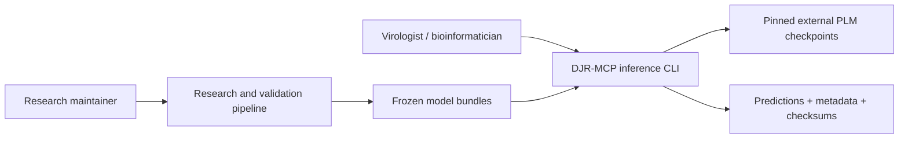
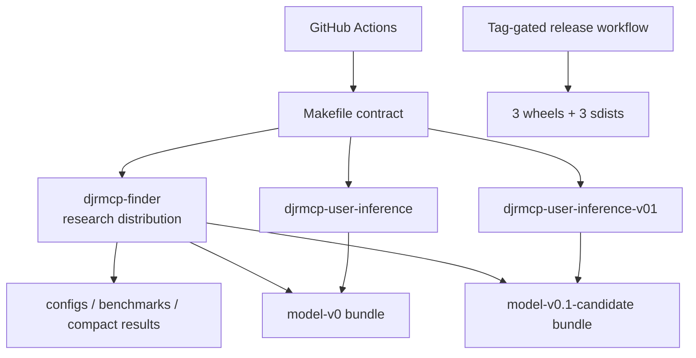
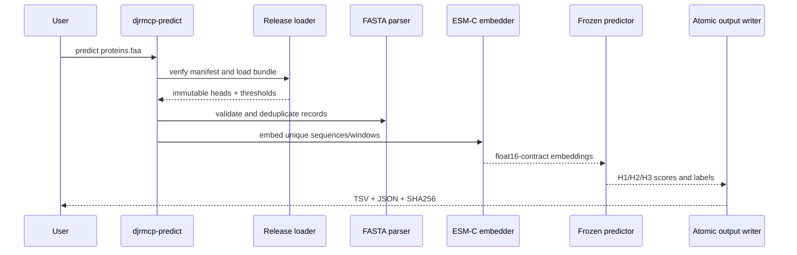

# DJR-MCP Finder architecture and repository map

**English** | [简体中文](ARCHITECTURE.cn.md) | [日本語](ARCHITECTURE.ja.md)

This document maps the repository's code areas, runtime entry points, verification commands, and
scientific boundaries. It supports onboarding and maintenance, but does not replace the scientific
protocol in [`WORKFLOW_V0.md`](research/WORKFLOW_V0.md).

## Part 1 — Whole-repository technical deep dive

### What the repository is

DJR-MCP Finder is a Python research pipeline plus two user-facing inference packages. The released
path accepts protein FASTA, computes pinned ESM-C embeddings, applies a frozen H1→H2→H3 cascade,
and writes predictions with metadata and checksums ([README](../README.md#L10-L17)). The candidate
package replaces the H1/H2 encoder but explicitly remains outside the released scientific identity
([release manifest](../release-manifest.json#L34-L50)).

### Detected stack

| Layer | Technology | Local evidence |
| --- | --- | --- |
| Language | Python 3.10+; Python 3.12+ for the complete contributor/candidate environment | [root metadata](../pyproject.toml#L5-L10), [candidate metadata](../user-inference-v0.1/pyproject.toml#L5-L18) |
| Packaging | PEP 517/621, setuptools, `src/` layout, three distributions | [root metadata](../pyproject.toml#L1-L10), [release manifest](../release-manifest.json#L8-L32) |
| Numerical/data | NumPy, pandas, scikit-learn, Biopython, joblib, PyYAML | [dependencies](../pyproject.toml#L42-L49) |
| Model runtimes | PyTorch, Hugging Face/Biohub Transformers, isolated candidate runtimes | [extras](../pyproject.toml#L52-L67), [candidate Dockerfile](../user-inference-v0.1/workstation/Dockerfile#L7-L29) |
| Test/lint/build | pytest, Ruff, PyPA build, Twine, Make | [dev dependencies](../pyproject.toml#L71-L77), [Makefile](../Makefile#L33-L73) |
| CI/release | GitHub Actions; tag-gated GitHub Release artifacts | [CI](../.github/workflows/ci.yml#L16-L129), [release workflow](../.github/workflows/release.yml#L17-L89) |
| Storage | Filesystem artifacts: FASTA, TSV/JSON, NPZ, checksum manifests | [output example](../README.md#L65-L76), [bundle package data](../user-inference-v0/pyproject.toml#L68-L75) |

### Entrypoints

| Entrypoint | Purpose | Evidence |
| --- | --- | --- |
| `djrmcp` | Research workflow plan and benchmark embedding CLI | [script registration](../pyproject.toml#L79-L80), [CLI parser](../src/djrmcp_finder/cli.py#L67) |
| `python scripts/run_v0_dataset.py` | Portable root entrypoint for V0 dataset construction | [Python runner](../scripts/run_v0_dataset.py) |
| `python scripts/run_postsplit_integrity_audit.py` | Portable root entrypoint for post-split integrity auditing | [Python runner](../scripts/run_postsplit_integrity_audit.py) |
| `djrmcp-predict` | Released Model V0 FASTA validation, model inspection, and prediction | [script registration](../user-inference-v0/pyproject.toml#L55-L56), [CLI main](../user-inference-v0/src/djrmcp_predict/cli.py#L189) |
| `djrmcp-predict-v01` | Candidate controller CLI using isolated workers | [script registration](../user-inference-v0.1/pyproject.toml#L49-L50), [CLI main](../user-inference-v0.1/src/djrmcp_predict_v01/cli.py#L403) |
| Workstation wrappers | Docker build, cache, GPU selection, and offline execution | [formal guide](../user-inference-v0/workstation/README.md), [candidate guide](../user-inference-v0.1/workstation/README.md) |

The prediction CLIs and workstation wrappers do not require PBS or `qsub`. The two root research
runners above also work without a scheduler; resource-intensive stages still require their declared
data, software, memory, and GPU resources where applicable.

### Commands and verification inventory

The root Makefile is the command authority; CI invokes its focused targets rather than duplicating
test semantics.

| Command | Purpose | Evidence |
| --- | --- | --- |
| `make setup` | Install all three development distributions under Python 3.12+ | [Makefile](../Makefile#L18-L21) |
| `make setup-core` / `setup-v0` / `setup-v01` | Install one surface | [Makefile](../Makefile#L23-L31) |
| `make metadata` | Check release/package/model/bundle mapping | [Makefile](../Makefile#L33-L34) |
| `make docs-check` | Check required docs, README size, and local links | [Makefile](../Makefile#L36-L37) |
| `make lint` | Run critical Ruff correctness rules | [Makefile](../Makefile#L39-L40) |
| `make test` | Run core, formal, and candidate suites | [Makefile](../Makefile#L42-L51) |
| `python -m pytest -q tests/test_cli.py` | Run one focused test module | [core test target](../Makefile#L42-L43), [example module](../tests/test_cli.py) |
| `make smoke` | Validate both FASTA parsers and frozen bundles without model downloads | [Makefile](../Makefile#L53-L61) |
| `make build` | Build three wheels and three sdists | [Makefile](../Makefile#L63-L67) |
| `make package-check` | Run Twine and inspect licenses, typed markers, notices, and metadata | [Makefile](../Makefile#L69-L71) |
| `make check` | Complete local CI-equivalent gate | [Makefile](../Makefile#L73) |

CI runs on pushes to `main`, pull requests, and manual dispatch
([CI triggers](../.github/workflows/ci.yml#L3-L7)). It covers all declared Python versions for the
root and formal packages, both candidate versions, metadata/docs, lint, smoke checks, and built
distributions ([CI jobs](../.github/workflows/ci.yml#L16-L129)).

The workflow defines the repository's automated verification surface. Whether those jobs are
configured as merge-blocking required checks is controlled in GitHub repository settings and is not
asserted by the files in this checkout.

### Directory layout

| Path | Purpose |
| --- | --- |
| `src/djrmcp_finder/` | Research configuration, embeddings, classifier selection/calibration, validation, and Test ledger |
| `tests/` | Core research-pipeline tests |
| `scripts/` | Portable Python research runners, pipeline stages, validators, figures, and engineering contract checks |
| `configs/` | Frozen or portable-rendered workflow configuration |
| `user-inference-v0/` | Released `model-v0` package and workstation deployment |
| `user-inference-v0.1/` | `model-v0.1-candidate` controller, workers, and workstation deployment |
| `benchmarks/` | Compact checksum-bound benchmark evidence, including optional historical HPC replay launchers |
| `results/` | Small published result identities and figures; large generated results remain excluded |
| `docs/` | Engineering, versioning, scientific interpretation, and reproducibility documentation |
| `.github/` | CI/release automation and contribution templates |

### Deployment and runtime surface

| Surface | Pin or constraint | Evidence |
| --- | --- | --- |
| Root/formal package minimum | Python `>=3.10` | [root](../pyproject.toml#L10), [formal](../user-inference-v0/pyproject.toml#L18) |
| Candidate package minimum | Python `>=3.12`, NumPy `==2.5.1` | [candidate](../user-inference-v0.1/pyproject.toml#L18-L40) |
| CI runners | Python 3.10–3.13 and current GitHub action majors | [CI matrix](../.github/workflows/ci.yml#L46-L108) |
| Formal container | `ubuntu:24.04`; pinned setuptools, wheel, NumPy, PyTorch, and Biohub commit | [formal Dockerfile](../user-inference-v0/workstation/Dockerfile#L1-L2), [runtime install](../user-inference-v0/workstation/Dockerfile#L43-L54) |
| Candidate container | Derived from formal V0; second Python 3.12 environment with pinned Transformers | [candidate Dockerfile](../user-inference-v0.1/workstation/Dockerfile#L1-L9), [overlay](../user-inference-v0.1/workstation/Dockerfile#L24-L57) |
| Release runner | Python 3.12; tag must be on `main` | [release workflow](../.github/workflows/release.yml#L38-L56) |

No service database, web server, queue, or authentication layer is deployed by this repository.
Large external model/data dependencies are filesystem/cache inputs rather than backing services.

### Lifecycle and dependency scan

- GitHub Actions versions remain explicit in workflow files and should be reviewed during each
  release.
- Python 3.10 lifecycle status is `[UNVERIFIED]` from the checkout. Because it is the minimum public
  version, maintainers should review its upstream security-support date before the next minor release.
- The formal runtime intentionally pins a Biohub Transformers Git commit. That is a reproducibility
  constraint, not a general-purpose dependency range; security fixes require a new validated bundle
  rather than an unreviewed bump.
- The candidate's exact NumPy and two Transformers runtimes are application-level reproducibility
  pins. They must not be copied into the root library dependency policy.

### Data, APIs, jobs, and tests

There is no network API owned by the project. External model and database access happens during
explicit user or research commands. Data contracts are FASTA input, frozen JSON/NPZ/checksum bundle
files, TSV/JSON prediction output, and checksum-bound benchmark records. Root research workflows are
started through portable Python entrypoints rather than an internal background-job service or a
required scheduler. Checksum-bound `benchmarks/*/pbs/` files remain only as optional historical HPC
replay evidence; they are not dependencies of ordinary FASTA prediction.

The test strategy has three independent suites and CPU-only smoke checks. GPU inference and full
archive replay remain workstation/HPC validations because their checkpoints and frozen databases
are outside the compact checkout ([reproducibility matrix](REPRODUCIBILITY.md#what-can-be-reproduced-locally)).

## Part 2 — Context and ecosystem

### Repository scope

| Field | Value |
| --- | --- |
| Repository | `Hongda-Zhao/DJR-MCP-Finder` |
| Primary function | Screen protein FASTA files for DJR-MCP candidates and supported viral phyla |
| Recommended screening model | Model V0.1 Candidate |
| Formal baseline | Released, frozen Model V0 |
| Repository release | `v0.1` |
| License | Scoped MIT; external assets retain upstream terms |

### Repository controls

- The [`Makefile`](../Makefile#L33-L73) centralizes metadata, documentation, lint, test, smoke, and
  package gates.
- [CI](../.github/workflows/ci.yml#L16-L128) runs those gates across the supported package and Python
  surfaces.
- The [pull-request template](../.github/pull_request_template.md) asks reviewers to check model
  identity, checksums, claims, input safety, and sensitive data.
- The [issue templates](../.github/ISSUE_TEMPLATE/) separate reproducible bugs, feature requests,
  and scientific interpretation questions.
- The machine-readable release manifest prevents prose-only version changes
  ([manifest](../release-manifest.json#L1-L51)).

### Contributor gotchas

- `make setup` needs Python 3.12 because it installs the candidate; smaller targets support Python
  3.10 where declared ([Makefile](../Makefile#L18-L31)).
- Full inference downloads large checkpoints and requires pinned runtime environments; normal tests
  and smoke checks do not.
- Historical absolute paths are provenance. Render site-local configuration instead of replacing
  them in place ([reproducibility guide](REPRODUCIBILITY.md#frozen-provenance)).
- A documentation-only edit inside a frozen bundle can invalidate its checksum manifest.
- `build/`, `dist/`, caches, environments, large arrays, and checkpoints are ignored; release
  artifacts come from CI, not committed build directories.

### Ecosystem relation visible from disk

The project consumes Biohub ESM-C, Meta ESM-2, PyTorch, Transformers, Biopython, and classical
bioinformatics outputs. Those remain upstream dependencies, not vendored services. The formal and
candidate packages are separately deployable, while the root research package preserves the
selection and evaluation workflow that produced their frozen heads.

## Part 3 — Architectural blueprint

### Level 1: system context

### Level 2: repository containers

### Level 3: formal prediction lifecycle

The loader verifies the bundle checksum manifest before constructing a release
([release loader](../user-inference-v0/src/djrmcp_predict/release.py#L35),
[bundle load](../user-inference-v0/src/djrmcp_predict/release.py#L194)). FASTA validation is a
separate boundary ([parser](../user-inference-v0/src/djrmcp_predict/fasta.py#L79)), and the predictor
owns the frozen cascade ([predictor](../user-inference-v0/src/djrmcp_predict/predictor.py#L18)).

### Layering and dependency rules

1. CLI modules orchestrate but do not redefine model constants.
2. Release loaders verify and parse bundle metadata before predictors receive weights.
3. FASTA parsing is independent of model runtimes, which keeps validation and smoke checks CPU-only.
4. Predictors depend on frozen release objects and embedding arrays, not on research training code.
5. Output writers own atomic file creation and result checksums.
6. Candidate workers isolate incompatible model runtimes; the controller routes only gate-through
   sequences to the ESM-C worker ([candidate worker launch](../user-inference-v0.1/src/djrmcp_predict_v01/cli.py#L150),
   [candidate prediction](../user-inference-v0.1/src/djrmcp_predict_v01/cli.py#L212)).

These rules are enforced by package separation, frozen bundle schemas/checksums, tests, and CI—not
by a separate architectural-lint tool.

### Cross-cutting concerns

| Concern | Implementation | Evidence |
| --- | --- | --- |
| Authentication | None; local CLI only | No service/API surface in package entrypoints |
| Configuration | JSON/YAML plus environment-variable path rendering | [reproducibility guide](REPRODUCIBILITY.md#portable-checkout) |
| Integrity | SHA-256 manifests before model load and after result write | [formal loader](../user-inference-v0/src/djrmcp_predict/release.py#L35) |
| Error handling | Fail-closed validation via exceptions and non-zero CLI exit | [formal CLI](../user-inference-v0/src/djrmcp_predict/cli.py#L117) |
| Logging/metadata | Structured run metadata and explicit command output | [output contract](../README.md#L65-L76) |
| Secrets | No embedded credentials; external caches/archives supplied by path | [environment template](../.env.example#L1-L15), [review checklist](../.github/pull_request_template.md#L30-L33) |
| Feature flags | Environment variables for device, cache, offline mode, and portable roots | [formal guide](../user-inference-v0/README.md) |
| Observability | Runtime metadata, checksums, validation JSON; no telemetry service | [formal Docker environment](../user-inference-v0/workstation/Dockerfile#L7-L15) |

### Inferred architectural decisions

#### ADR: Keep released and candidate inference packages separate

- **Context:** The candidate uses incompatible Transformers environments and has weaker evidence.
- **Decision:** Separate distribution, import namespace, CLI, bundle, and container.
- **Alternatives:** One package with runtime switches would blur status and increase dependency conflicts.
- **Consequences:** Some duplicated controller code, but explicit provenance and safer installation.

#### ADR: Verify frozen artifacts before deserialization

- **Context:** Classifier heads and scientific metadata must remain content-addressed.
- **Decision:** Verify manifest hashes before loading and distribute pickle-free NPZ heads.
- **Alternatives:** Trusting files by path is simpler but cannot detect mutation.
- **Consequences:** Notice/model-card edits also require checksum refreshes.

#### ADR: Use static package versions plus a cross-layer manifest

- **Context:** Three distributions and two scientific model identities do not share one lifecycle.
- **Decision:** Keep PEP 440 versions per distribution and validate their mapping centrally.
- **Alternatives:** A single Git-derived version would incorrectly imply every model/package changed together.
- **Consequences:** Release preparation updates a small manifest, enforced by CI.

### Governance and release enforcement

CI executes the documented verification jobs on pushes and pull requests. Merge-blocking enforcement
belongs to repository settings rather than the version-controlled workflow. The tag release workflow
validates tag syntax, releaser identity, ancestry on `main`, manifest agreement, Twine metadata,
wheel/sdist contents, and then attaches artifacts with only `contents: write` permission in the
release job ([release gates](../.github/workflows/release.yml#L17-L89)). PyPI is deliberately outside
the active workflow until OIDC Trusted Publishing and a protected environment are configured.

### How to add a feature

1. Identify whether the change belongs to the research package, formal inference, or candidate.
2. Preserve model/evidence identity unless the scientific release gates explicitly authorize a new one.
3. Add tests in the corresponding suite and a CPU-only smoke path when possible.
4. Update user docs, the [changelog](repository/CHANGELOG.md), and `release-manifest.json` if any
   identifier changes.
5. Run the focused `make` target, then `make check`.
6. Use the [pull-request template](../.github/pull_request_template.md) to record scientific,
   checksum, input-safety, and data impacts, then require the relevant CI jobs to pass.

## Subsystem deep dives

### Research selection and Test ledger

The research CLI exposes the workflow plan and embedding stages
([CLI](../src/djrmcp_finder/cli.py#L67-L114)). Embedding loads manifest/FASTA records, applies a
fixed long-sequence window policy, and writes resumable content-addressed outputs
([records](../src/djrmcp_finder/stages/embedding.py#L87),
[windows](../src/djrmcp_finder/stages/embedding.py#L131),
[stage](../src/djrmcp_finder/stages/embedding.py#L237)). Classifier code separates calibration from
the one protected Test path, with explicit authorization and ledger state
([calibration](../src/djrmcp_finder/stages/classifier.py#L1689),
[authorization](../src/djrmcp_finder/stages/classifier.py#L1900),
[Test evaluation](../src/djrmcp_finder/stages/classifier.py#L2194)). This is the most sensitive
scientific boundary: ordinary engineering changes must not create a bypass.

### Released inference package

The formal CLI resolves a default bundled release, validates checksum identity, parses FASTA, embeds
deduplicated sequences, runs the frozen predictor, and writes atomic outputs. The package deliberately
keeps model downloads in the optional inference extra; tests and model inspection need only NumPy
([formal metadata](../user-inference-v0/pyproject.toml#L39-L53)). This separation is why CI can prove
input and bundle contracts without a GPU.

### Candidate controller and workers

The candidate bundle maps H1/H2 to ESM-2 3B and H3 to ESM-C 6B. The controller validates one bundle,
spawns workers through separately selected Python interpreters, and routes only H1/H2-positive
sequences to H3. The worker is an explicit CLI process boundary
([worker parser](../user-inference-v0.1/src/djrmcp_predict_v01/worker.py#L251),
[worker main](../user-inference-v0.1/src/djrmcp_predict_v01/worker.py#L263)). The derived container
preserves the validated V0 environment while overlaying the incompatible ESM-2 environment
([container design](../user-inference-v0.1/workstation/Dockerfile#L7-L29)). Residual risk is
scientific, not just technical: exact parity and clean routing do not constitute external confirmation.

## Confidence assessment

| Claim area | Confidence | Basis |
| --- | --- | --- |
| Package names, versions, entrypoints | High | Parsed local `pyproject.toml` and release manifest |
| CLI/data flow | High | Local source and tests |
| Container/runtime pins | High | Local Dockerfiles and validation records |
| Scientific evidence status | High | Frozen bundle metadata and workflow documents |
| CI job coverage | High | Local workflow files |
| Merge-blocking policy | Not asserted | Required checks and branch protection are repository settings outside the checkout |
| External dependency lifecycle | Unverified | Must be reviewed against upstream release/support policies |
| Full archive replay | Inferred/conditional | Requires external checksum-bound archives not present locally |

## Footnotes — key local sources

- [`README.md`](../README.md) establishes user value, public workflow, and interpretation boundary.
- [`release-manifest.json`](../release-manifest.json) establishes cross-layer identity.
- [`Makefile`](../Makefile) establishes canonical developer commands.
- [`pyproject.toml`](../pyproject.toml) and the two inference manifests establish package/runtime surfaces.
- [`.github/workflows/ci.yml`](../.github/workflows/ci.yml) and
  [`.github/workflows/release.yml`](../.github/workflows/release.yml) establish automation.
- [`WORKFLOW_V0.md`](research/WORKFLOW_V0.md) establishes the scientific protocol and Test boundary.
- The formal and candidate `release.json` files establish frozen bundle contracts and status.
