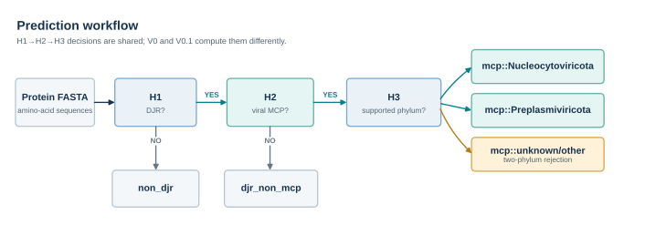
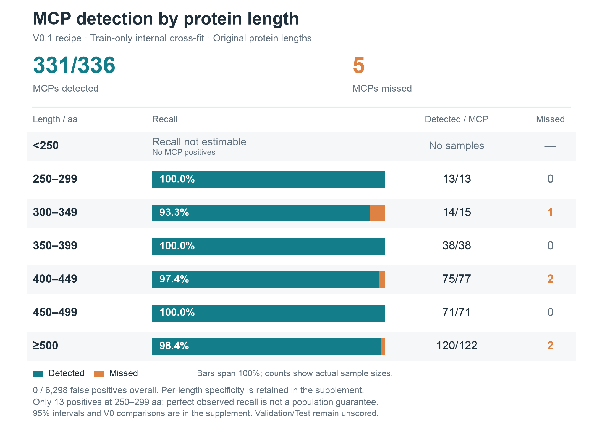

[English](../../README.md) | [简体中文](README.cn.md) | **日本語**

[](https://github.com/Hongda-Zhao/DJR-MCP-Finder/actions/workflows/ci.yml)
[](https://github.com/Hongda-Zhao/DJR-MCP-Finder/releases/latest)
[](https://www.python.org/)
[](../../LICENSE)

# DJR-MCP Finder

DJR-MCP Finder は、タンパク質 FASTA から double-jelly-roll major capsid protein（DJR-MCP）候補をスクリーニングします。タンパク質ごとに各段階のスコアと最終ラベルを出力し、判定できる場合は Nucleocytoviricota または Preplasmiviricota に分類します。

- [Model V0.1 Candidate](../../user-inference-v0.1/README.ja.md) は、探索的スクリーニングで優先する実験的候補モデルです。DJR/MCP の判定に ESM-2 3B、ウイルス門の分類に V0 の凍結済み ESM-C 6B ヘッドを使います。
- [Model V0](../../user-inference-v0/README.ja.md) は、リリース済み・凍結済みのベースラインです。すべての段階で ESM-C 6B を使い、引き続きサポートしています。

どちらのバージョンも、独立した外部検証はまだ行われていません。

**ソフトウェア v0.2** は任意の長さ保護プレビューを追加します。250 aa 未満は `mcp_unreliable_short_sequence` と `NA` スコアを返し、それ以上は固定 V0.1 を使います。これは陰性ではなく判定保留であり、モデルの再学習は行っていません。

## 予測フロー



DJR 候補を検出する H1、MCP とそれ以外の DJR タンパク質を区別する H2、対応するウイルス門に分類するか `unknown/other` を返す H3 の三段階で判定します。バージョンごとの計算経路は、上記のユーザーガイドを参照してください。

## クイックスタート

推奨環境は Linux、Docker、NVIDIA Container Toolkit、およびメモリ 24 GB 以上で BF16 に対応する CUDA GPU です。通常の FASTA 予測に HPC ジョブスケジューラは不要です。

```bash
git clone https://github.com/Hongda-Zhao/DJR-MCP-Finder.git
cd DJR-MCP-Finder/user-inference-v0
bash workstation/build.sh

cd ../user-inference-v0.1
DJRMCP_EXPECTED_BASE_IMAGE_ID='' bash workstation/build.sh

bash workstation/run_user_fasta.sh \
  /absolute/path/to/proteins.faa \
  run_output/my_sample \
  0
```

V0.1 は V0 の Docker イメージをベースにするため、先に V0 をビルドしてください。`DJRMCP_EXPECTED_BASE_IMAGE_ID` を空にすると、ローカルで再ビルドした際に過去のイメージ ID との照合を省略できます。バージョン、環境、チェックサムの確認は引き続き行われます。

初回の予測時に、固定バージョンのモデル重みがダウンロードされます。

## 出力

結果は次の場所に保存されます。

```text
run_output/my_sample/
├── predictions.tsv
├── run_metadata.json
└── CHECKSUMS.sha256
```

`predictions.tsv` には、タンパク質ごとのスコア、各段階の判定、最終ラベルが記録されます。以下は V0.1 の出力形式の例です（一部の列を抜粋）。

| protein_id | head1_djr_probability | head2_mcp_probability | head3_prediction | final_prediction |
| --- | ---: | ---: | --- | --- |
| candidate_001 | 0.997 | 0.981 | Nucleocytoviricota | `mcp::Nucleocytoviricota` |
| cellular_djr_002 | 0.994 | 0.082 | not_reached | `djr_non_mcp` |
| background_003 | 0.006 | NA | not_reached | `non_djr` |

最終ラベルは `non_djr`、`djr_non_mcp`、`mcp::Nucleocytoviricota`、`mcp::Preplasmiviricota`、`mcp::unknown/other` の五種類です。最後のラベルは、H1/H2 を通過したものの、対応する二つのウイルス門のどちらにも確実に分類できなかったことを示します。新種や未知のウイルスを確認したという意味ではありません。

出力はスクリーニング結果であり、構造解析や人手による確認が必要です。スコアは自然試料での出現頻度を補正していないため、大規模なスクリーニングでは偽陽性を別途評価する必要があります。

## モデル評価

開発データは完全一致配列の重複除去後に 11,060 件で、Train 6,634 件、Validation 2,212 件、Test 2,214 件に分割されています。以下の評価は Train のみを使い、両モデルで同じ 5 分割を用いています。各 component が複数の分割にまたがることはありません。値は平均 ± 標準誤差です。

| Train のみの 5 分割交差検証 | Model V0 | Model V0.1 Candidate |
| --- | ---: | ---: |
| H1 AP | `0.9985 ± 0.0003` | `0.9993 ± 0.0004` |
| H2 AP | `1.0000 ± 0.0000` | `1.0000 ± 0.0000` |
| H3 known-phylum macro-F1 | `0.9806 ± 0.0095` | `0.9806 ± 0.0095` |
| 総合スコア `S` | `0.9971 ± 0.0009` | `0.9976 ± 0.0010` |

`S = 0.60 × H1 AP + 0.30 × H2 AP + 0.10 × H3 macro-F1` です。V0.1 は H1 AP の平均がわずかに高く、H2 AP は同値、H3 は同じモデルを再利用しています。これらは開発時の候補選択に用いた結果であり、統計的に有意な優位性や外部データでの性能を示すものではありません。

データ構成、14 種のエンコーダーの比較、その他の評価は、[科学的エビデンス](../SCIENTIFIC_EVIDENCE.ja.md)にまとめています。

### タンパク質長別の性能

元の配列長別評価は保存済み embedding を CPU 上で再利用し、Train 内の component 分離による cross-fit を使います。各セルは MCP 再現率と検出数/陽性数を示し、上のモデル選択 CV とは別の評価です。

| 長さ / aa | Model V0 | Model V0.1 Candidate |
| --- | ---: | ---: |
| <250 | N/A (n=0) | N/A (n=0) |
| 250–299 | **100.0%** (13/13) | **100.0%** (13/13) |
| 300–349 | **93.3%** (14/15) | **93.3%** (14/15) |
| 350–399 | **100.0%** (38/38) | **100.0%** (38/38) |
| 400–449 | **98.7%** (76/77) | **97.4%** (75/77) |
| 450–499 | **97.2%** (69/71) | **100.0%** (71/71) |
| ≥500 | **99.2%** (121/122) | **98.4%** (120/122) |

全長区間で V0.1 は **331/336 MCP（98.5%）** を検出し、観測された偽陽性は **0/6,298**（V0 は 3/6,298）でした。250 aa 未満には陽性例がなく、250–299 aa も 13 例です。内部開発結果であり、母集団での誤りゼロや独立検証を意味しません。対応のある切断評価は未完了です。



[評価手順、信頼区間と集計表](../../benchmarks/short_sequence_v1/README.ja.md).

## ドキュメント

- [Model V0.1 Candidate](../../user-inference-v0.1/README.ja.md) と [Model V0](../../user-inference-v0/README.ja.md) のユーザーガイド
- [再現性](../REPRODUCIBILITY.ja.md)：公開データ、モデル、研究ワークフロー
- [コード構成](../ARCHITECTURE.ja.md)と[ドキュメント一覧](../README.ja.md)

- [V0.2 設計とポリシープレビュー](../research/MODEL_V02_DESIGN.ja.md)：250 aa 未満は判定保留、それ以外は固定 V0.1。新モデルの学習は未実施です。

## 引用とライセンス

研究で DJR-MCP Finder を使用する場合は、[`CITATION.cff`](../../CITATION.cff) に従って引用し、使用したモデルのバージョンを明記してください。

本プロジェクト独自のコードと文書には [MIT License](../../LICENSE) が適用されます。
